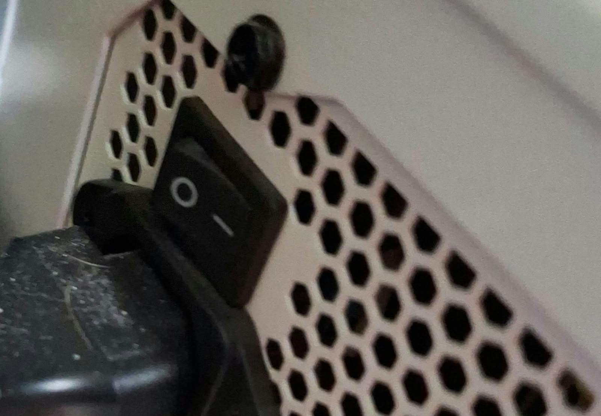
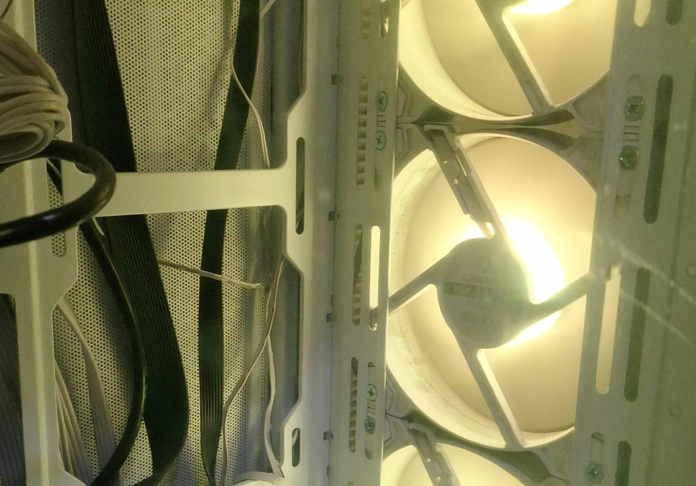
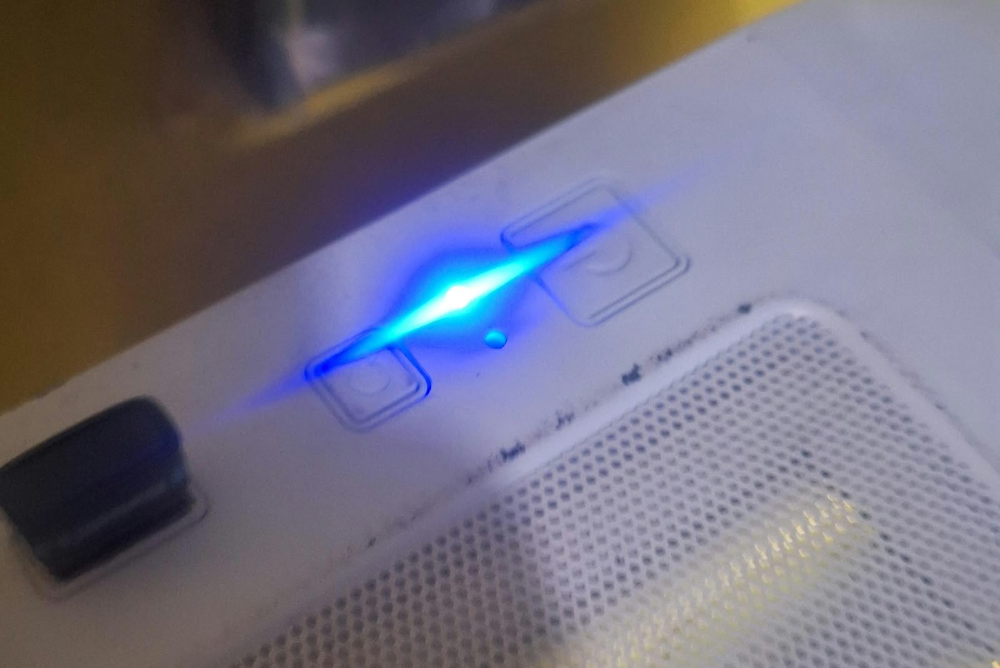
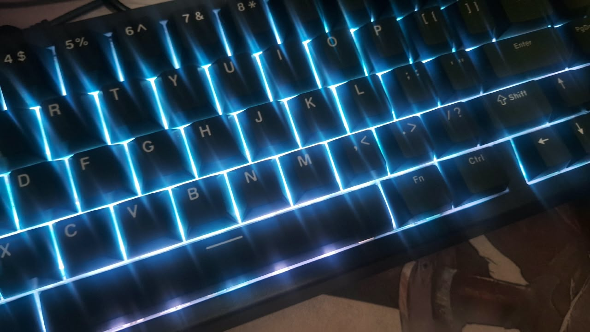

# sesion-08a

## apuntes sesión
se hablo mas a profundidad de clases y funciones, luego hicimos un codigo que tuviera una perilla, boton y led
## encargos

encargo-08a:

1. tomar muchas fotos, mínimo 3 por cada uno de los 3 elementos que estudiamos hoy: perillas, botones, y luces. subir las fotos a su README como respuesta a este encargo, y describirlas textualmente, para con esa info complejizar nuestras clases programadas este viernes.

2. partir del ejemplo de hoy, que está subido en codigos/ de hoy, y hacer que las luces parpadeen. para eso, definir parpadeo de forma paramétrica.
---

> **Código:** El código correspondiente se encuentra en la carpeta [`codigo/tarea-parpadeo`](https://github.com/tomascatri/dis8645-2026-2-procesos-2/tree/main/04-tomascatri/sesion-08a/codigo/tarea-parpadeo).
--- 

### 1. Botón de la fuente de poder (PSU)

- **Descripción y funcionamiento:** Interruptor basculante de corte general de la fuente de alimentación. Al posicionarlo en apagado (`0`), se corta por completo el suministro eléctrico hacia la placa madre y demás componentes (a excepción de la energía residual temporal en los condensadores). A diferencia del botón de encendido del gabinete —que interactúa mediante señales lógicas y suele dejar al equipo en estados de bajo consumo o suspensión (S-states)—, este switch corta la fase de manera física directa.
- **Estados:** Dispone de 2 estados binarios fijos: encendido (I) y apagado (O).

---

### 2. Iluminación de ventiladores RGB

- **Descripción y funcionamiento:** Sistema de iluminación LED RGB integrado en los ventiladores del gabinete. Además de cumplir una función estética y de visibilidad interna, se controlan mediante un botón dedicado en el panel superior que permite ciclar entre distintos patrones y paletas de color. Si se mantiene presionado dicho botón durante unos segundos, el circuito apaga la iluminación por completo.

---

### 3. LED de estado y panel frontal

- **LED de estado:** Indicador luminoso de color azul que reporta el estado operativo del equipo. Permite diagnosticar fallas de energía a simple vista: si el equipo no responde pero el LED está encendido, el fallo no es de alimentación principal; si titila con rapidez, puede advertir anomalías según el código de la placa.
- **Panel de botones:**
  - **Botón de control LED:** Alterna modos y niveles de brillo de la iluminación del chasis.
  - **Botón de reinicio (*Reset*):** Reinicia el hardware y el sistema operativo de forma inmediata.
  - **Botón de encendido/apagado (*Power*):** Envía la señal de arranque o apagado al sistema, permitiendo además forzar el corte de energía si se mantiene presionado de manera prolongada.

---

### 4. Mouse óptico RGB

- **Botones (6 en total):**
  - 2 clics principales (izquierdo y derecho).
  - 1 botón en la rueda de desplazamiento (*scroll click*).
  - 2 botones laterales (navegación / macros configurables).
  - 1 botón central superior para conmutar perfiles de DPI (sensibilidad del sensor).
- **Iluminación:** Iluminación LED RGB direccionable y programable por software. Cuenta con retroalimentación contextual reactiva a eventos del sistema o videojuegos (por ejemplo, alertar en color rojo ante un nivel bajo de vida) o ecualización visual reactiva al sonido ambiente y multimedia.

---

### 5. Teclado magnético RGB

- **Formato e interruptores:** Teclado en formato compacto 60% con *switches* magnéticos (tecnología de efecto Hall). Al carecer de contacto metálico físico tradicional para registrar la pulsación, permite configurar el punto de actuación (*actuation point*) y la función de *rapid trigger* con precisión milimétrica, registrando el accionamiento con apenas un toque superficial o según la profundidad personalizada por tecla.
- **Iluminación:** Retroiluminación RGB individual por tecla, sincronizable por software para reaccionar a la telemetría del equipo, audio o efectos dinámicos interactivos al pulsar.

## lectura
