# sesion-08a

## Clase 061026

## apuntes sesión

### pre-clase

Siento que hace mucho no escribía sobre algo o daba mi opinión sobre alguna cosa, mi cabeza realmente ha estado en mil partes y mi ánimo no ha estado de lo mejor, mi rendimiento académico no ha sido bueno sobre todo en taller. No le he puesto el esfuerzo que merece y me siento desmotivada, antes me daba ánimo hacer los encargos y venir, pero ahora ya no, esto no es culpa de los docentes, sino mía, termino agotada del trabajo y debo seguir trabajando todo el día, mi responsabilidad ante eso es gigante y siempre estoy haciendo algo lo cual me deja cansadamentalmente. 

Aarón me reclamó (no en un sentido negativo) que no respondiera su mensaje escrito personalmente por mail y no lo respondí porque no lo he hecho, no he leído nada, no he hecho ningún ejercicio porque no he entendido nada y no estoy motivada, no me da ganas hacerlo, pero a pesar de esto, valoro lo que me dijo, valoro que se haya dado el tiempo de responderme y hacerme ver esta lectura de otra forma. Creo que mi punto de partida sera motivarme a leer, no soy una persona lectora y los libros me causan terror, como hablamos el semestre pasado, sigo con un tema de no entender nada y se que eso no es importante y que nadie nace sabiendo, pero las sensaciones no se van de la noche a la mañana.

Para poder llegar a escribir todo esto es porque lo he reflexionado y a alguien más le puede ayudar también, por eso lo escribo en un lugar público, taller no es solo estudiar y aprender cosas, si no conocerse a uno mismo, conocer como uno se enfrenta a los cosas, que te gusta y que no. La programación es algo que me llama la atención y lo que hemos visto si me gusta, pero no sé si estoy en un punto que que quiera llevarlo tan a fondo, se que en el futuro en algo me ayudara tener esto que estoya aprendiendo porque tendré un punto de partida, no estaré en el limbo. 

Aarón siempre que me ve me comenta que estoy en todos lados siempre y porque eso me gusta estar haciendo, estar de aquí para allá, ayudando en lo que se pueda, moviendome y experimentando en lo que ya estoy incerta. 

Estas palabras no me van a regalar un 7 ni nada, pero creo que hay que saber expresarse, hay que decir lo que uno siente y este es el proceso del resultado final de las cosas que uno finalmente entrega. 

### clase

hay personas pero yo también soy personas, pero hay otras personas

Las clases sirven para modelar o para crear comportamientos 

Las clases deben tener clasificaciones para poder especificar que es 

clases tienen atributos y los otros métodos

Las clases sirven para ahorrar espacio, ordenar y mantención. 

constructor crear cosas partir de la clase 

palabra nombre valor de la patita

propagar comportamientos: osea por ejemplo, cuando están las luces de navidad y son 100 uno puede decir haz que esta haga algo y la otra lo contrario. 

backstreet void

instancias de clases y 

tengo la clase lucecita
y despues creo la clase espanta cuco que también puedo ocupar la clase lucecita 

https://www.ikea.com/

sintaxis

## encargos

encargo-08a:

1. tomar muchas fotos, mínimo 3 por cada uno de los 3 elementos que estudiamos hoy: perillas, botones, y luces. subir las fotos a su README como respuesta a este encargo, y describirlas textualmente, para con esa info complejizar nuestras clases programadas este viernes.

  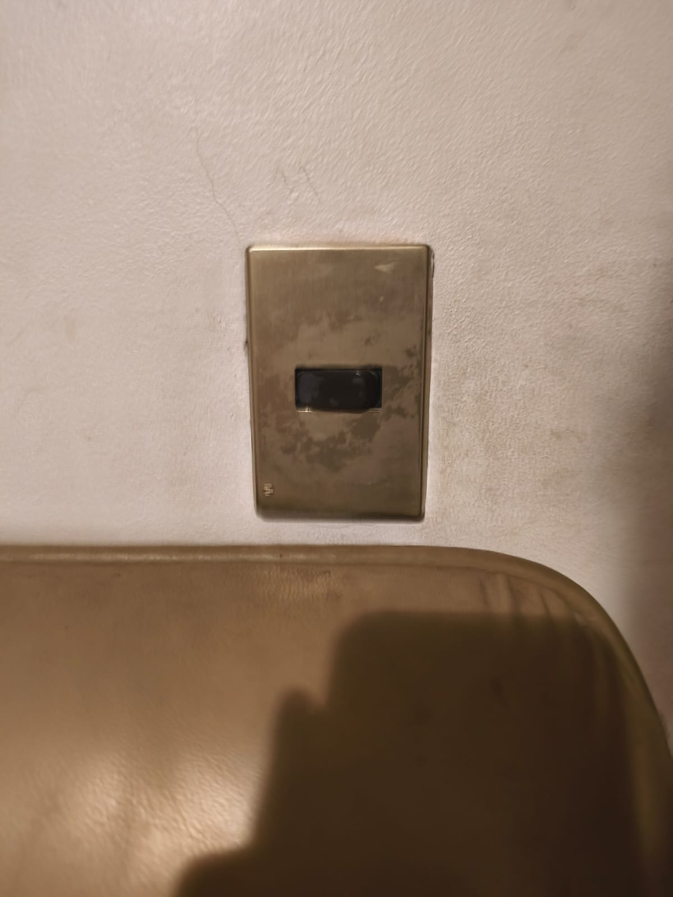
  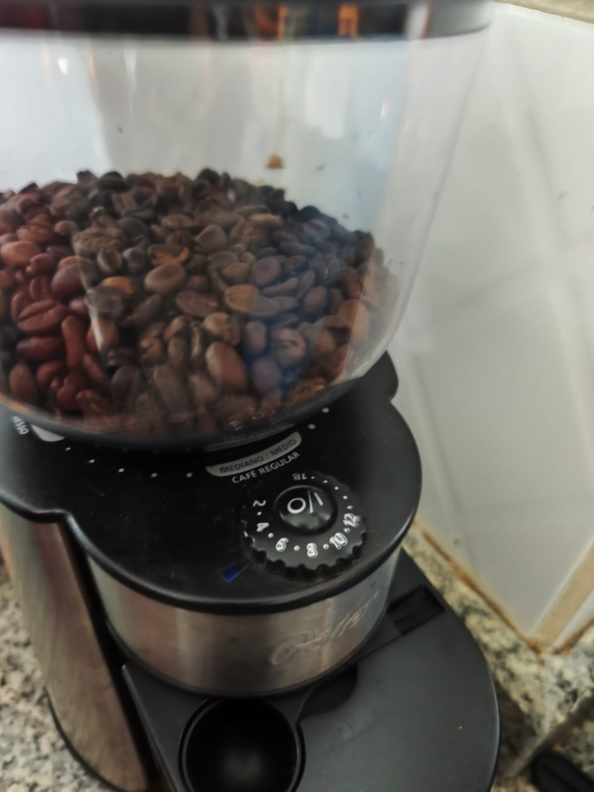
  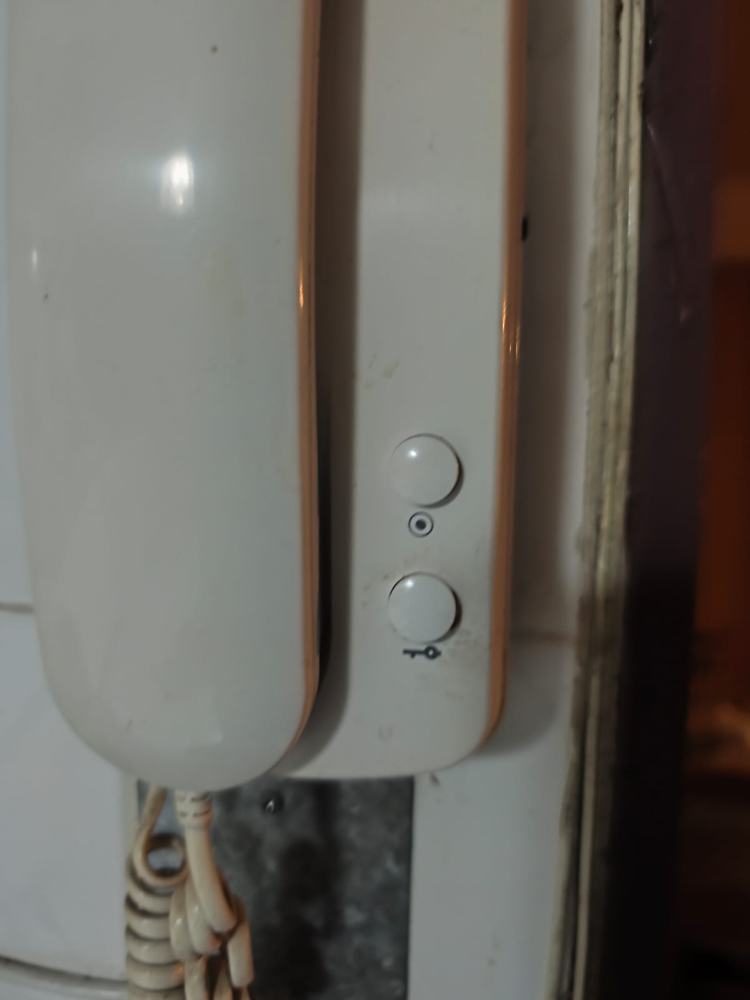

 

  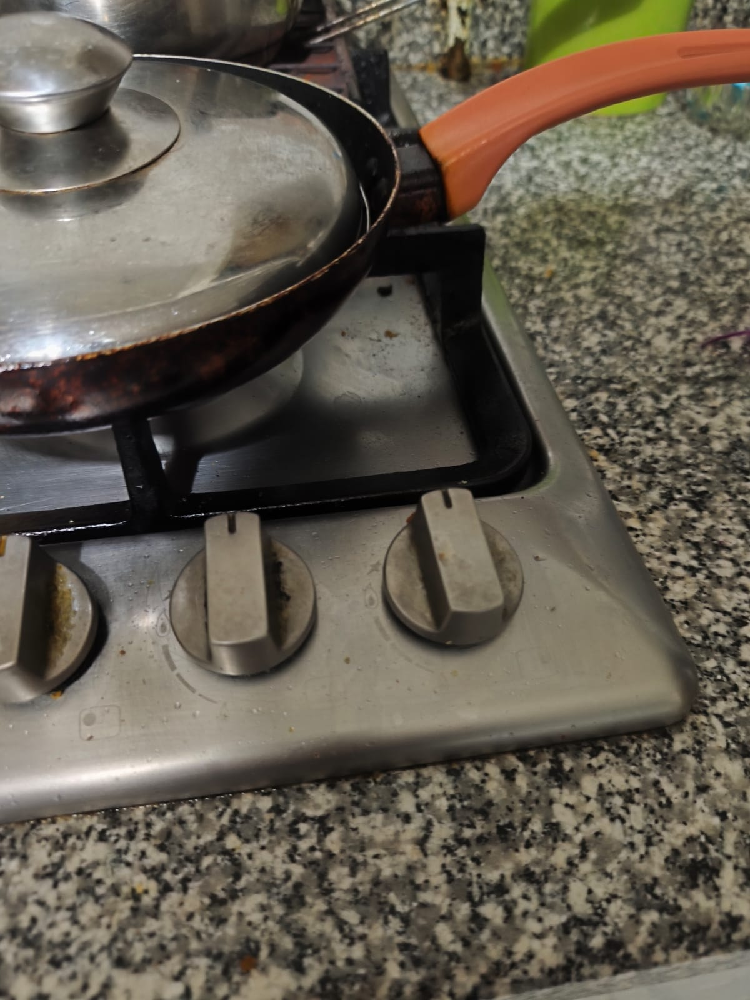
  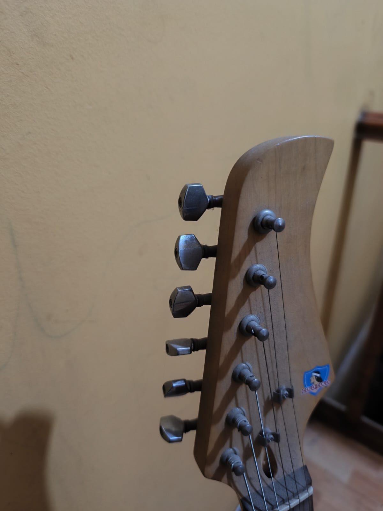
  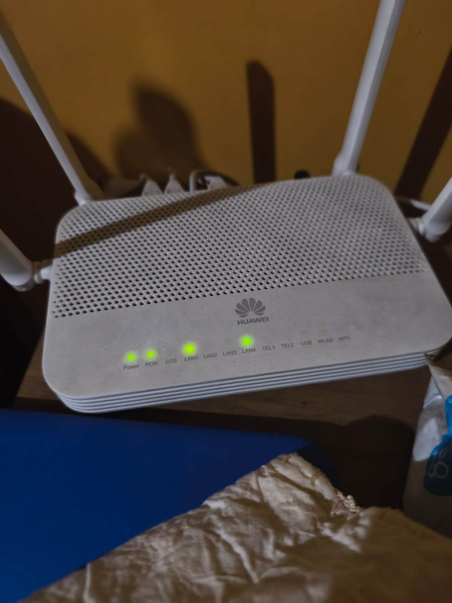

 

  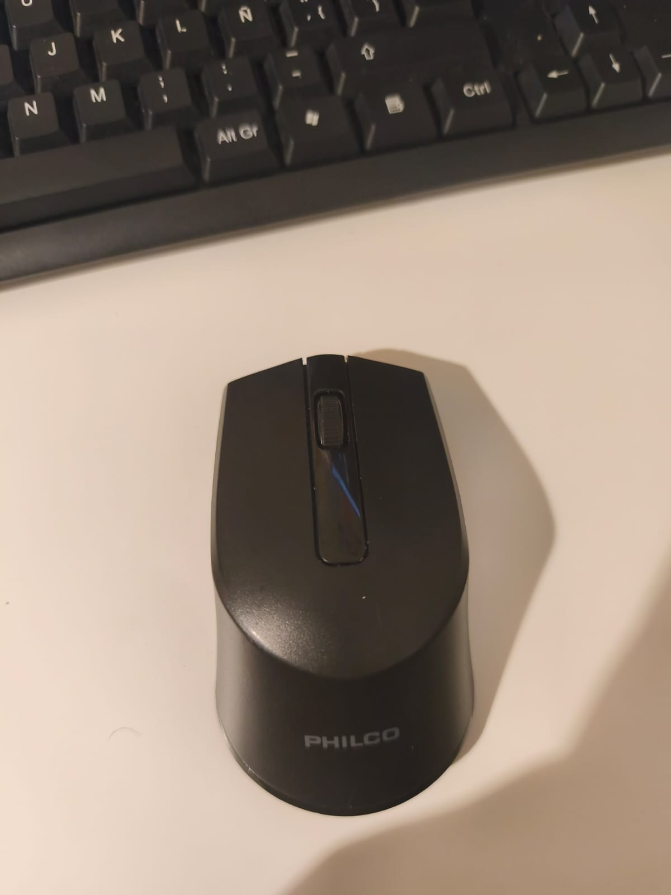
  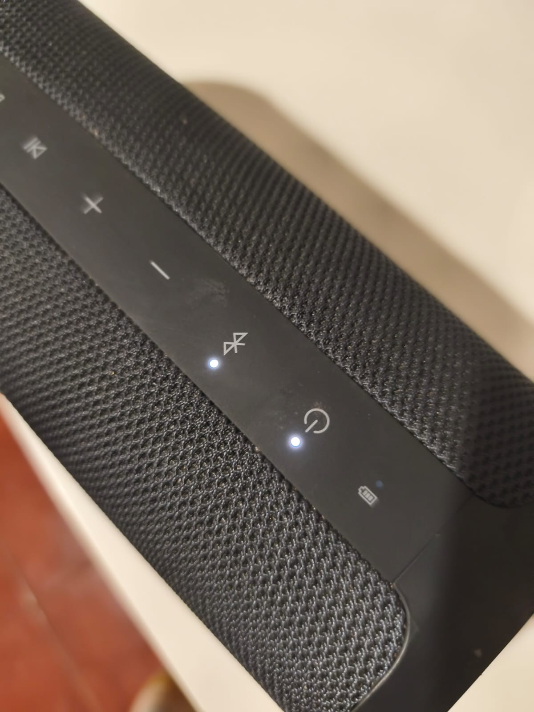
  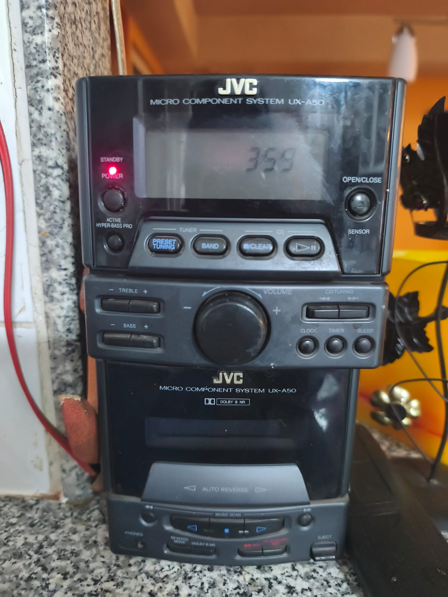

 

  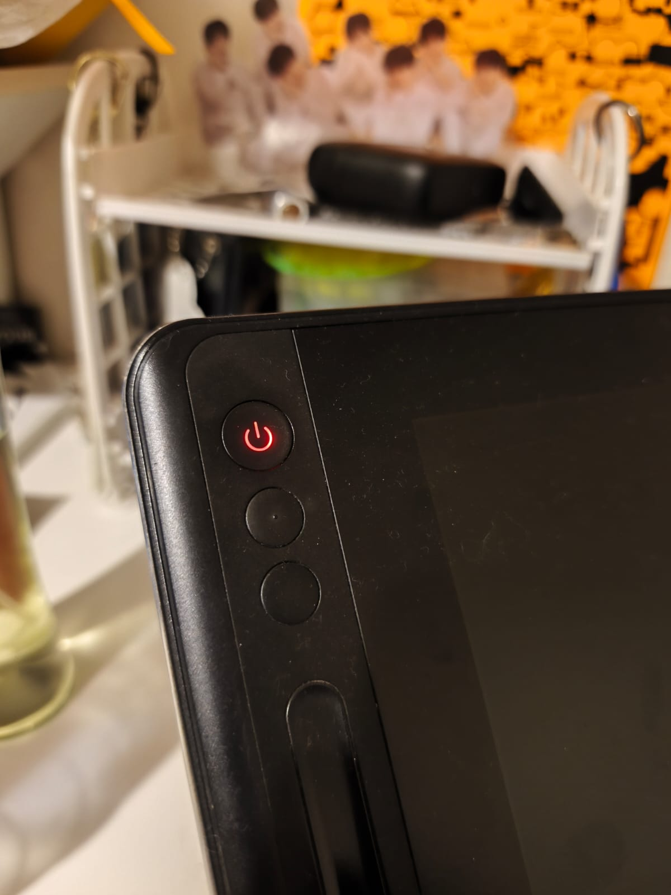
  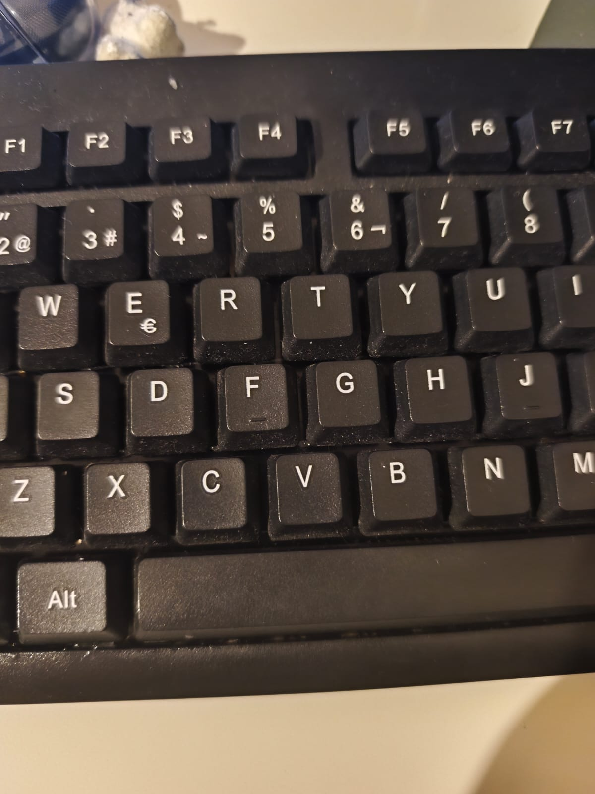

**Foto 1 Interruptor luz:** 

* Descripción y funcionamiento: es el interruptor de mi pieza de estudio que solo enciende y apaga la luz.   
* Estado: encendido (1) y apagado (0)

**Foto 2 moledora de café:** 

* Descripción y funcionamiento: este molesto café tiene una perilla que ayuda a cuan molido quieres que esté el café, ya que no todos los cafés se hacen con el mismo molido, ayuda a la intensidad, etc.   
* Estado: Va girando y se detiene en el número que tu escojas.

3. partir del ejemplo de hoy, que está subido en codigos/ de hoy, y hacer que las luces parpadeen. para eso, definir parpadeo de forma paramétrica.

## lectura
