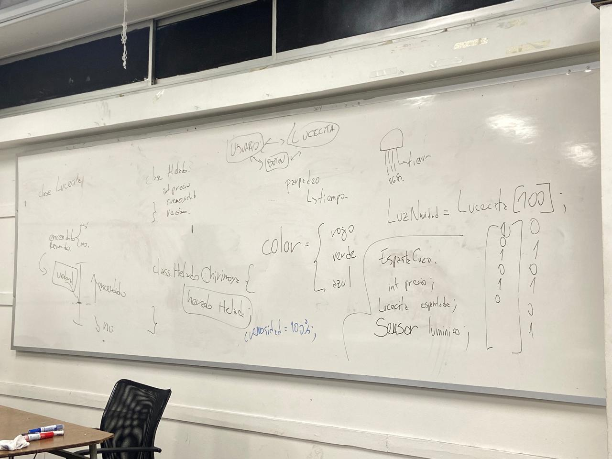

# sesion-08a

Hoy la locomoción estaba terrible, porque el clima también lo estaba, o como dijo el chicken little: "el cielo se cae"

## apuntes sesión

## encargos

encargo-08a:

1. tomar muchas fotos, mínimo 3 por cada uno de los 3 elementos que estudiamos hoy: perillas, botones, y luces. subir las fotos a su README como respuesta a este encargo, y describirlas textualmente, para con esa info complejizar nuestras clases programadas este viernes.

2. partir del ejemplo de hoy, que está subido en codigos/ de hoy, y hacer que las luces parpadeen. para eso, definir parpadeo de forma paramétrica.

https://wokwi.com/projects/477335809803977729 (para que no se me pierda)

## lectura
