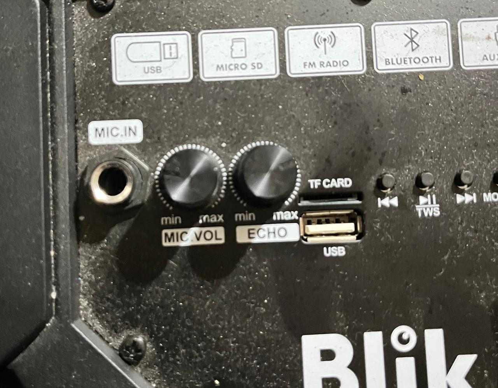
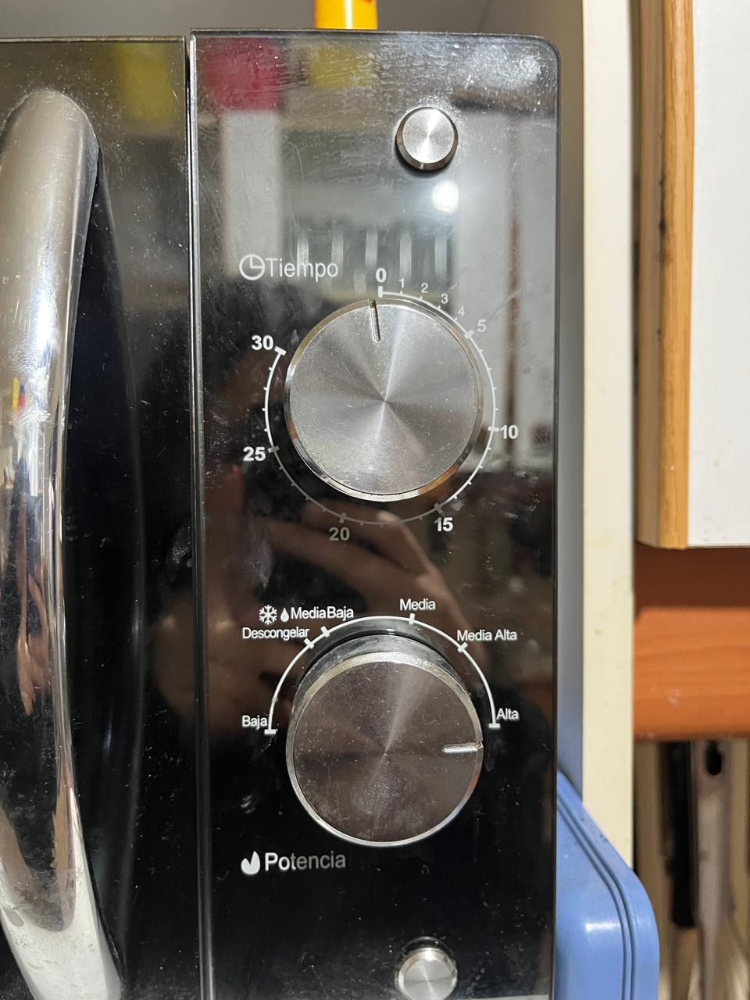
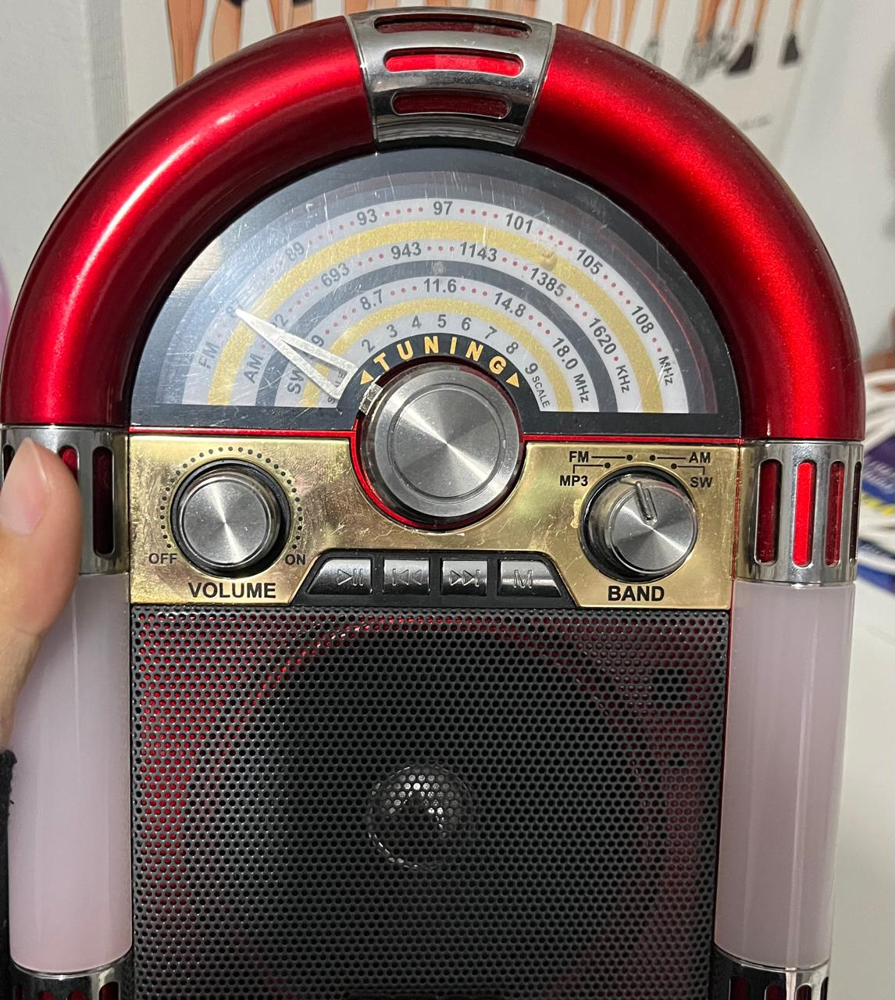
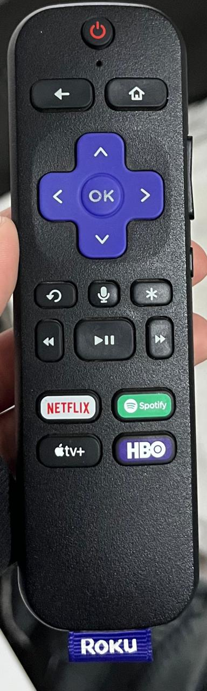
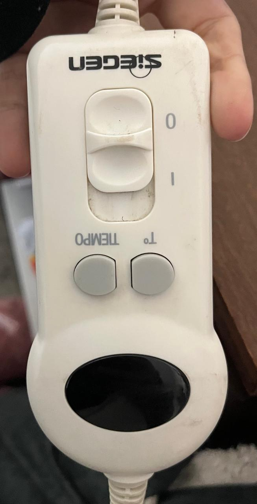
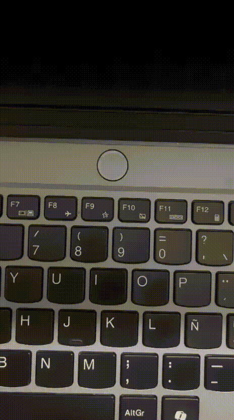
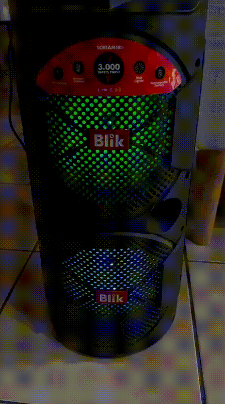
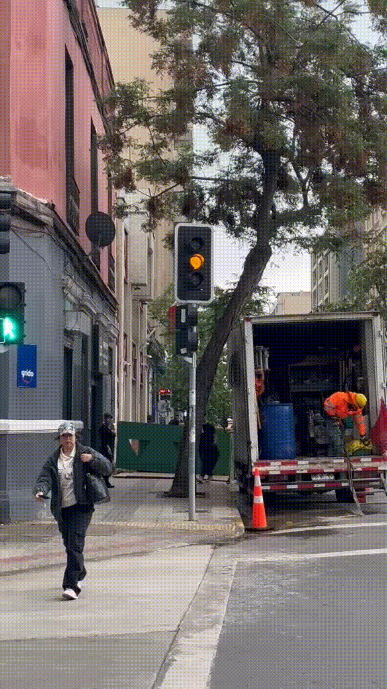

# sesion-08a

## apuntes sesión
- hoy realizamos un repaso de las *clases*

### Lógica de las clases
```
personas -- isi 
no nos llamamos personas
yo (isi) soy una persona
```
modelar -- hacer aproximación burda de la realidad -- no lo realizaremos tanto 

crear

clasificar

a estas se les pueden dar atributos, los cuales funcionan como diferenciadores
```
atributos -- forma
métodos -- función
  constructor -- crear objetos a partir de la clase
```


---
### Wokwi
- realizamos durante la clase un ejercicio en wokwi a cerca de cómo programar un botón +  perilla + luz
<https://wokwi.com/projects/477140774861255681>

**material complementario**

<https://github.com/piruetasxyz/Perilla>

<https://github.com/piruetasxyz/Boton>

OOP -- programación orientada a objetos

wiki data: base de datos wikipedia

h -- promesas

cpp -- cómo hace lo que promete

ADC mayor resolución 0 - 4095 -- 12 bites -- binario (valores potenciómetro) 

<https://designblog.uniandes.edu.co/blogs/dise2609/files/2009/03/marc-auge-los-no-lugares.pdf> 

---
### caja negra 
- se mencionó en la clase el término de "caja negra" el cual se le denomina así a cualquier sistema o aparato cuyo funcionamiento interno se desconoce, dándole énfasis en lo que entra (input) y lo que sale (output)
```
caja negra input - output
```


- filosofía de las cajas negras: este texto se mencionó en clases, lo cual hablé por el discord para que mandaran el link para poder leerlo ya que me interesó el tema

<https://monoskop.org/images/8/8d/Flusser_Vilem_Hacia_una_filosofia_de_la_fotografia.pdf>

---
## encargos

encargo-08a:

1. tomar muchas fotos, mínimo 3 por cada uno de los 3 elementos que estudiamos hoy: perillas, botones, y luces. subir las fotos a su README como respuesta a este encargo, y describirlas textualmente, para con esa info complejizar nuestras clases programadas este viernes.




**perilla 1:** parlante de mi casa, la cual sirve con un mínimo y un máximo para intensificar el eco y el volumen del micrófono conectado al parlante mediante cable.



**perilla 2:** microondas, la primera regula tiempo en la cual la comida se calienta dentro del microondas y la segunda tiene distintas funciones, en donde la flecha indica en que función se encuentra actualmente (función alta para calentar comida).



**perilla 3:** perilla de una radio y parlante, las cuales moderan encendido y apagado de esta + volumen y función, si deseas escuchar radio AM FM o mp3.


**botón 1:** botones de lavadora que tienen dos funciones, encendido y apagado de esta e inicio o pausa de la carga de ropa dentro de esta.



**botón 2:** botones los cuales cumplen la función de dirigir la pantalla de la televisión, ya sea arriba, abajo, al lado, "ok", volumen, etc.



**botón 3:** botones los cuales al presionarlos regulan temperatura y tiempo del calientacamas.



**luz 1:** luz que parpadea, ya que el computador se encuentra en un estado de pantalla apagada pero de igual forma encendido (suspendido).



**luz 2:** luz la cual se guía por el ritmo de la música que suena actualmente en el parlante.



**luz 3:** luz del semáforo, la cual una parpadea para advertir a los peatones el no cruzar, porque cambiará de color y dejará pasar a los autos que vienen, y la segunda que se muestra en el gif es la del cambio de color del semáforo de los autos, que funciona como un símbolo de advertencia, próximo al rojo para detenerse.

2. partir del ejemplo de hoy, que está subido en codigos/ de hoy, y hacer que las luces parpadeen. para eso, definir parpadeo de forma paramétrica.

<https://wokwi.com/projects/477140774861255681>

**wokwi nuevo**
<https://wokwi.com/projects/477358360928893953>

## lectura
- hoy realicé la lectura de un nuevo capítulo llamado ""

*apuntes lectura*
- como sociedad de plantea que el pensamiento es capaz de impedir nuestras acciones o incluso el aprendizaje
- conocimiento -- no puede ser descrito en palabras o ser captado por el pensamiento consciente
- conocimiento -- acción, imagen, símbolos
- palabras y diagramas representables como acción
- componente -- desarrollo de técnicas que aumenten la potencia y los diagramas
- buen aprendiz -- aprender a sobrepasar la frontera de lo que podemos expresar con palabras
- desarrollo lenguajes descriptivos
- relación entre ciencia y habilidades físicas
- conceptos programación como marco conceptual para aprender habilidad física en particular
- programación -- fuente de dispositivos descriptivos -- medio para fortalecer el lenguaje
- lenguaje algebraico -- espacio
- lenguaje espacial -- fenómenos algebraicos
- describir analíticamente algo
- informática -- ciencia de las descripciones -- se requiere para realizar muchas cosas y para conseguir que una computadora realice algo se necesita que el proceso se deescriba con suficiente precisión para llevarlo a cabo por la máquina
- programación estructurada -- subdividir programa en partes nativas 
