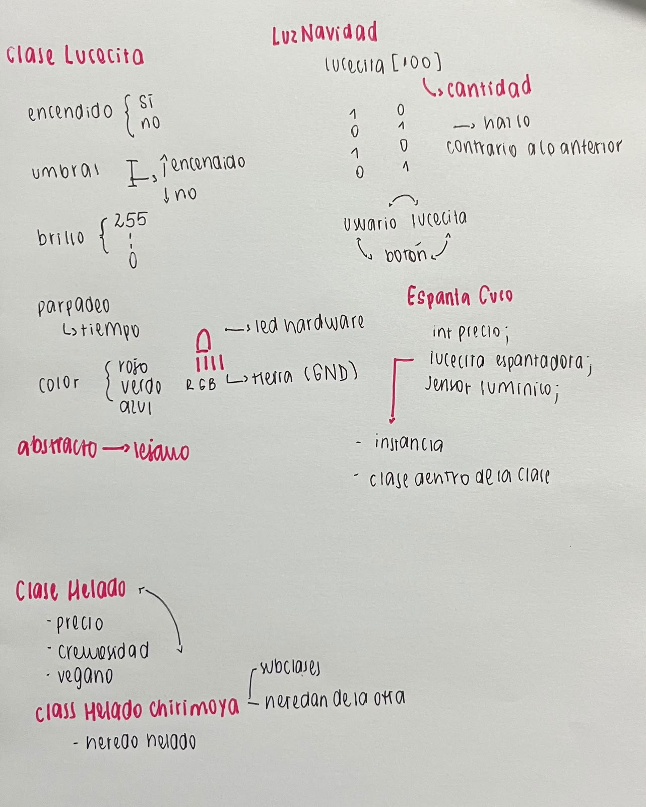
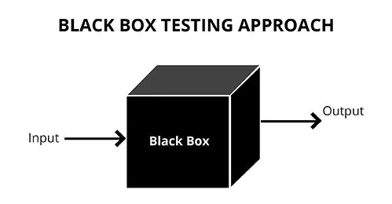

# sesion-08a

## apuntes sesión
- hoy realizamos un repaso de las *clases*

### Lógica de las clases
```
personas -- isi 
no nos llamamos personas
yo (isi) soy una persona
```
modelar -- hacer aproximación burda de la realidad -- no lo realizaremos tanto 

crear

clasificar

a estas se les pueden dar atributos, los cuales funcionan como diferenciadores
```
atributos -- forma
métodos -- función
  constructor -- crear objetos a partir de la clase
```


---
### Wokwi
- realizamos durante la clase un ejercicio en wokwi a cerca de cómo programar un botón +  perilla + luz
<https://wokwi.com/projects/477140774861255681>

**material complementario**

<https://github.com/piruetasxyz/Perilla>

<https://github.com/piruetasxyz/Boton>

OOP -- programación orientada a objetos

wiki data: base de datos wikipedia

h -- promesas

cpp -- cómo hace lo que promete

ADC mayor resolución 0 - 4095 -- 12 bites -- binario (valores potenciómetro) 

<https://designblog.uniandes.edu.co/blogs/dise2609/files/2009/03/marc-auge-los-no-lugares.pdf> 

---
### caja negra 
- se mencionó en la clase el término de "caja negra" el cual se le denomina así a cualquier sistema o aparato cuyo funcionamiento interno se desconoce, dándole énfasis en lo que entra (input) y lo que sale (output)
```
caja negra input - output
```


- filosofía de las cajas negras: este texto se mencionó en clases, lo cual hablé por el discord para que mandaran el link para poder leerlo ya que me interesó el tema

<https://monoskop.org/images/8/8d/Flusser_Vilem_Hacia_una_filosofia_de_la_fotografia.pdf>

---
## encargos

1. Una tonelada de fotos, mínimo 3, perillas, botones, luces, descripciones textuales.
2. Tomar las clases que se hicieron hoy y lograr que parpadeen.

<https://wokwi.com/projects/477140774861255681>
   
## lectura
- hoy realicé la lectura de un nuevo capítulo llamado ""

*apuntes lectura*
- como sociedad de plantea que el pensamiento es capaz de impedir nuestras acciones o incluso el aprendizaje
- conocimiento -- no puede ser descrito en palabras o ser captado por el pensamiento consciente
- conocimiento -- acción, imagen, símbolos
- palabras y diagramas representables como acción
- componente -- desarrollo de técnicas que aumenten la potencia y los diagramas
- buen aprendiz -- aprender a sobrepasar la frontera de lo que podemos expresar con palabras
- desarrollo lenguajes descriptivos
- relación entre ciencia y habilidades físicas
- conceptos programación como marco conceptual para aprender habilidad física en particular
- programación -- fuente de dispositivos descriptivos -- medio para fortalecer el lenguaje
- lenguaje algebraico -- espacio
- lenguaje espacial -- fenómenos algebraicos
- describir analíticamente algo
- informática -- ciencia de las descripciones -- se requiere para realizar muchas cosas y para conseguir que una computadora realice algo se necesita que el proceso se deescriba con suficiente precisión para llevarlo a cabo por la máquina
- programación estructurada -- subdividir programa en partes nativas 
