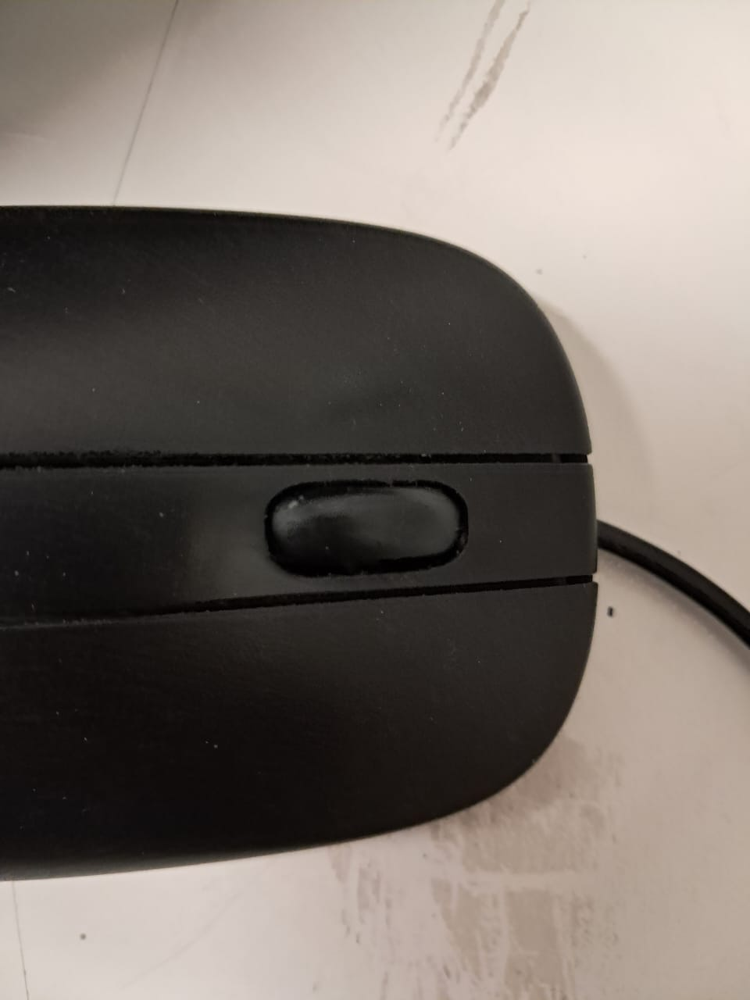
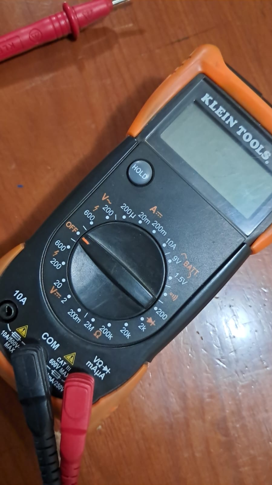
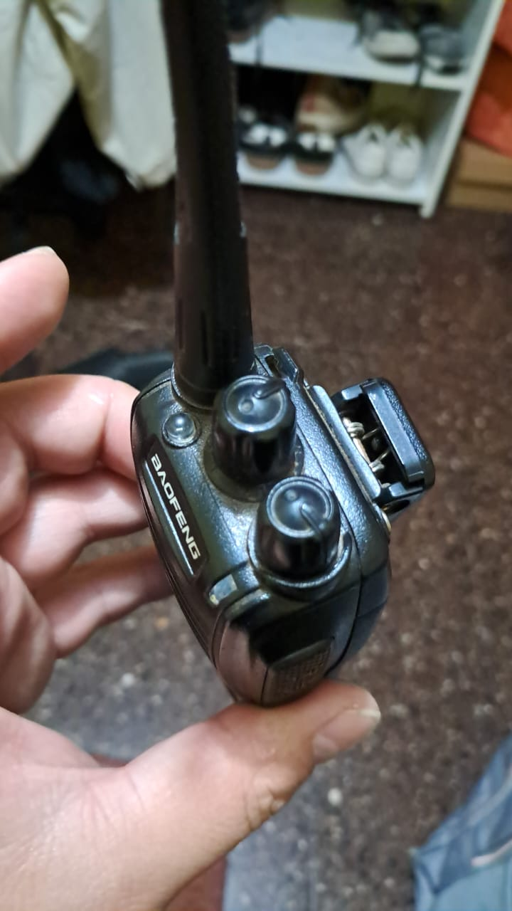
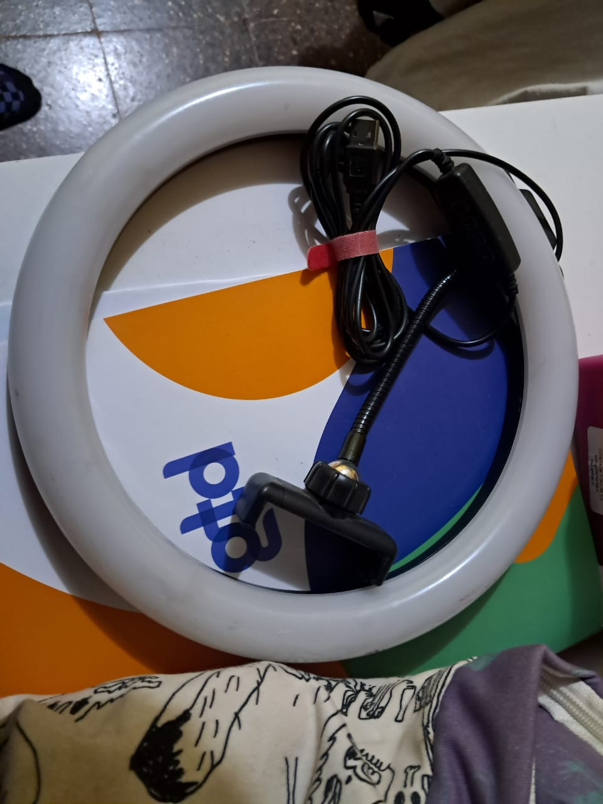
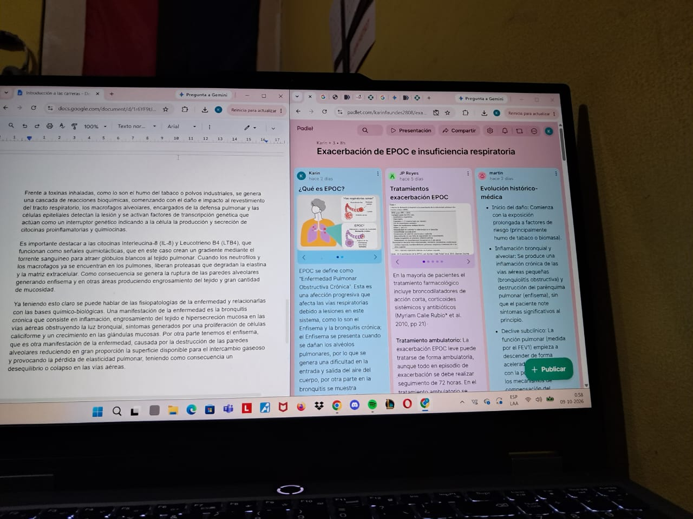
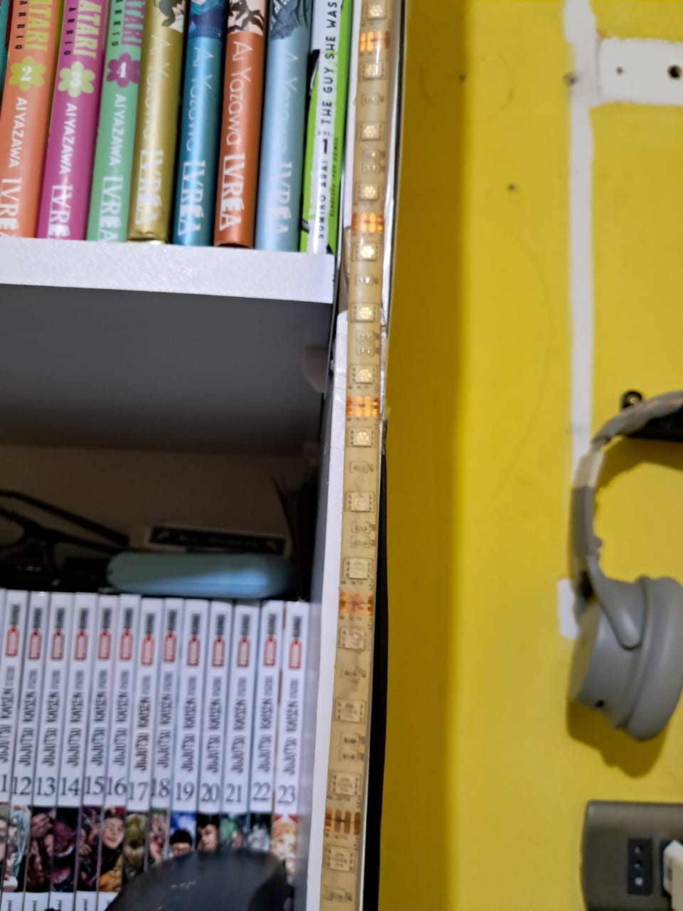
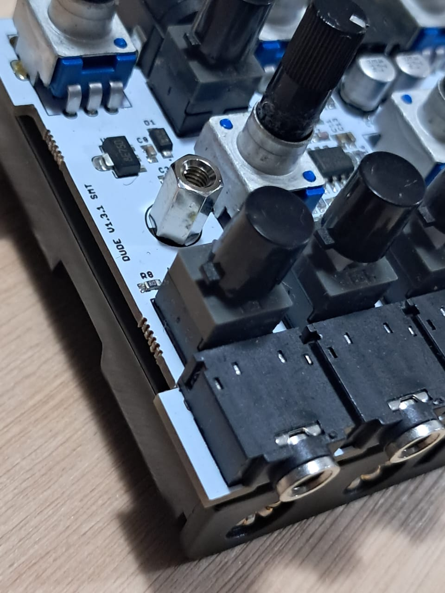
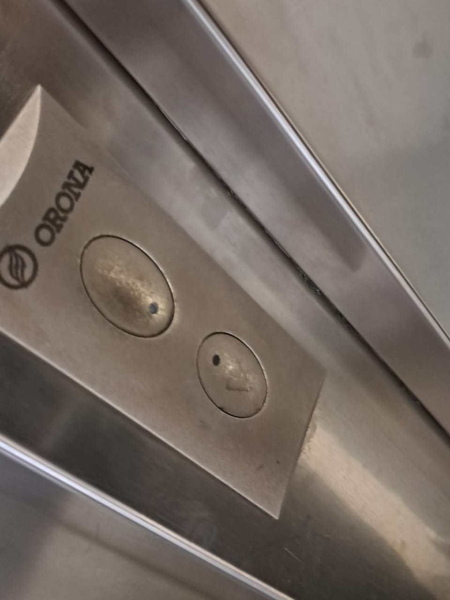
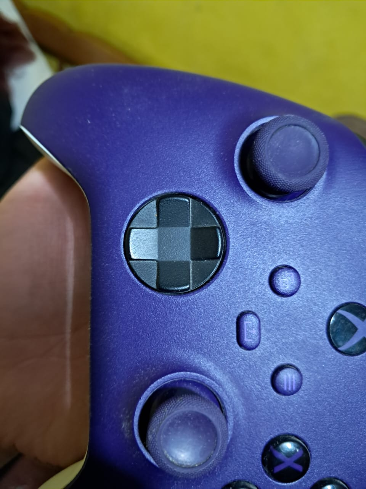
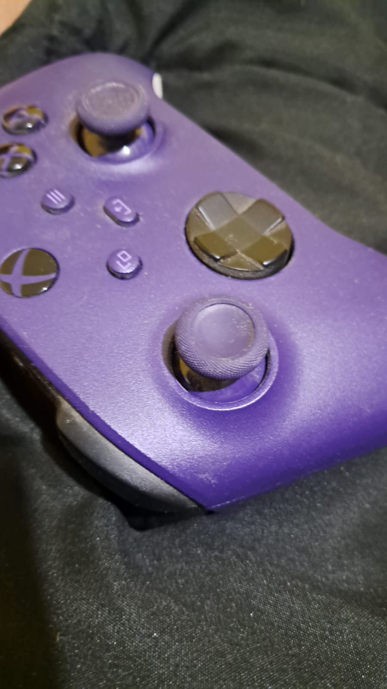

# sesion-08a

## apuntes sesión

## encargos

encargo-08a:

1. tomar muchas fotos, mínimo 3 por cada uno de los 3 elementos que estudiamos hoy: perillas, botones, y luces. subir las fotos a su README como respuesta a este encargo, y describirlas textualmente, para con esa info complejizar nuestras clases programadas este viernes.

### perilllas

| # | imagen | descripción |
| - | ------ | ----------- |
| 1 |  | Esta perilla no consta de inicio ni fin, pero el dispositivo que lo utiliza (computador) _recuerda_ la posición en la que queda. Sumado a todo esto se puede presionar, por lo que consta de un _bóton_ que se puede accionear |
| 2 |  | Acá la perilla posee 20 posiciones definidas en las que puede rotar, pero además tampoco posee un inicio y un fin en su recorrido. A diferencia del ejemplo anterior, existe una sección que cumple la función de seleccionador, por lo que tiene un punto de referencia importante en su posición|
| 3 |  | En este caso tenemos dos ejemplos en uno. El primero corresponde a un selector de canales, muy similar al casoa anterior, la diferencia radica en que aquí si posee un inicio y fin en el recorrido   El segundo es bastante parecido a un potenciometro común, solo que acá existe una pequeña _traba_ al inicio del recorrido, que una vez superada inicia su normal funcionamiento. Esta sección sirve a modo de interruptor, ya que este controla el volumen |

### luces

| # | imagen | descripcion |
| - | ------ | ----------- |
| 1 |  | Este aro de luz led posee 2 modos, los que van desde menor a mayor intencidad y el control de la calides de la luz. El encendido es constante, es decir que no posee ningún modo de secuencia u oscilación |
| 2 |  | La pantalla de un computador está compuesta de luces Red, Blue y Green. Estas según su intensidad pueden generar imagenes. Además poseen una luz blanca que "_retroilumina_", por lo que si están las RGB apagadas, igualmente se percibe algo de luz |
| 3 |  | Una tira de luces led posee 3 colores en un solo encapsulado, pudiendo controlar de manera individual cada uno de ellos

### botones 

| # | imagenes | descripción |
| - | -------- | ----------- |
| 1 |  | En este caso consta de un botón que "_recuerda_" su posición. Se podría definir como interruptor |
| 2 |  | Botón pulsador que al ser presionado mantiene encendida una luz por un periodo de tiempo variable
| 3 |  | Esta cruceta, es un conjunto de botones, que pueden ser presionados, existen 8 posibles opciones a presionar | 

### caso extra

Realizando el ejercicio me percaté y no supe como definir un Joystick, ya que permite movimiento como una perilla, pero su funcionamiento es similar a un botón que detecta presión al desplazarlo en cada dirección

2. partir del ejemplo de hoy, que está subido en codigos/ de hoy, y hacer que las luces parpadeen. para eso, definir parpadeo de forma paramétrica.

Me fui en volá https://wokwi.com/projects/477369782983665665

## lectura
