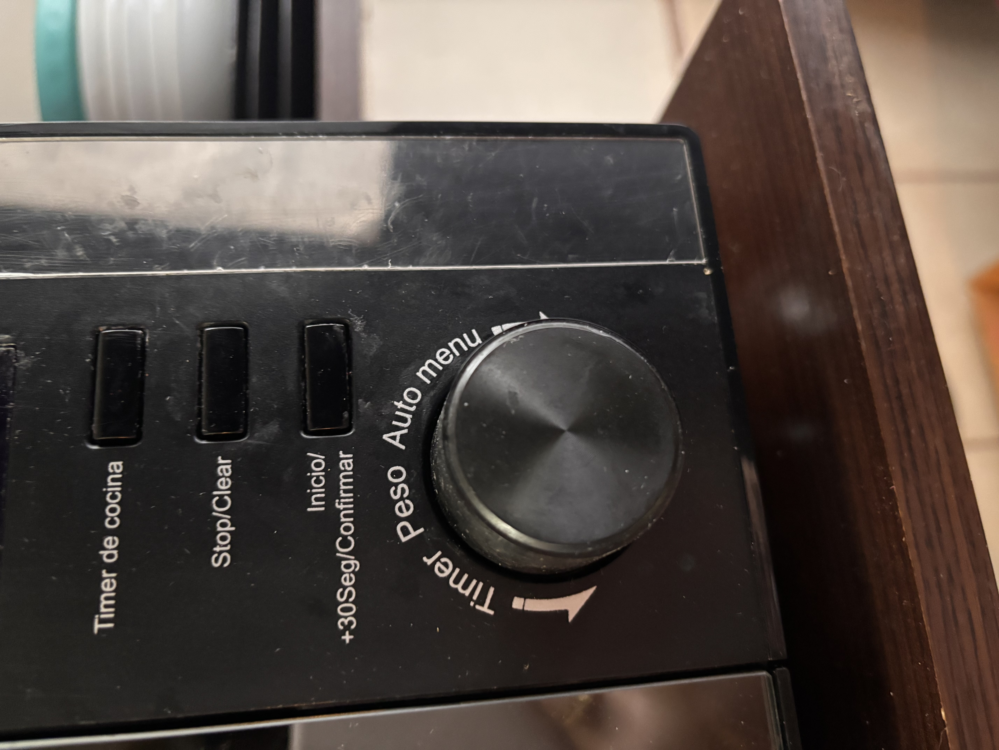
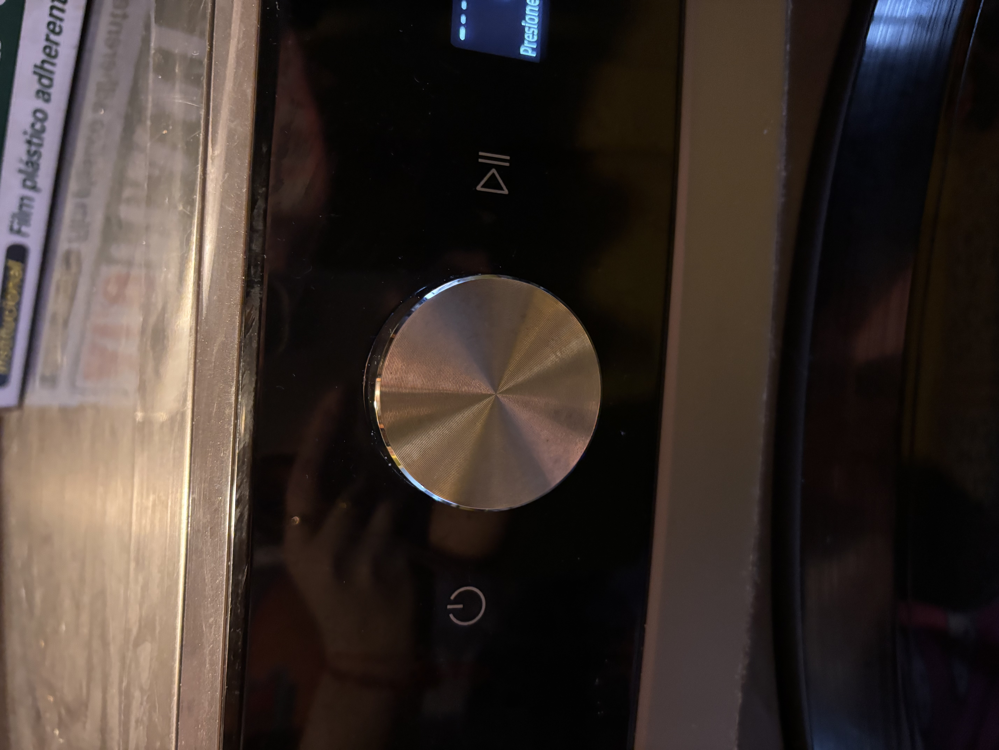
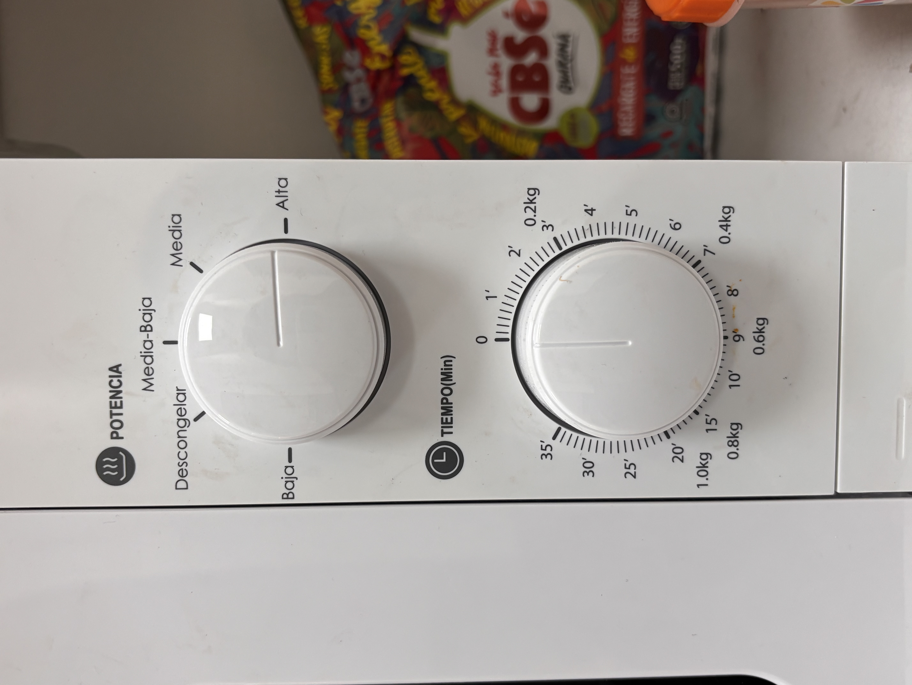
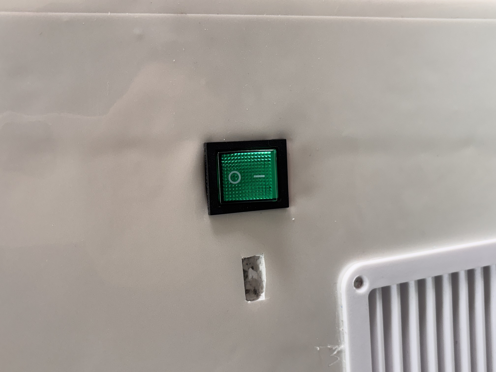
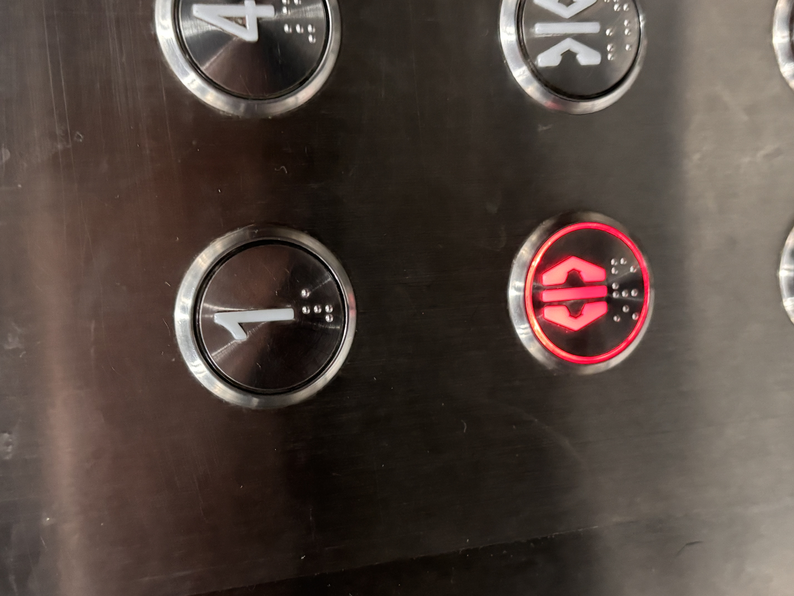
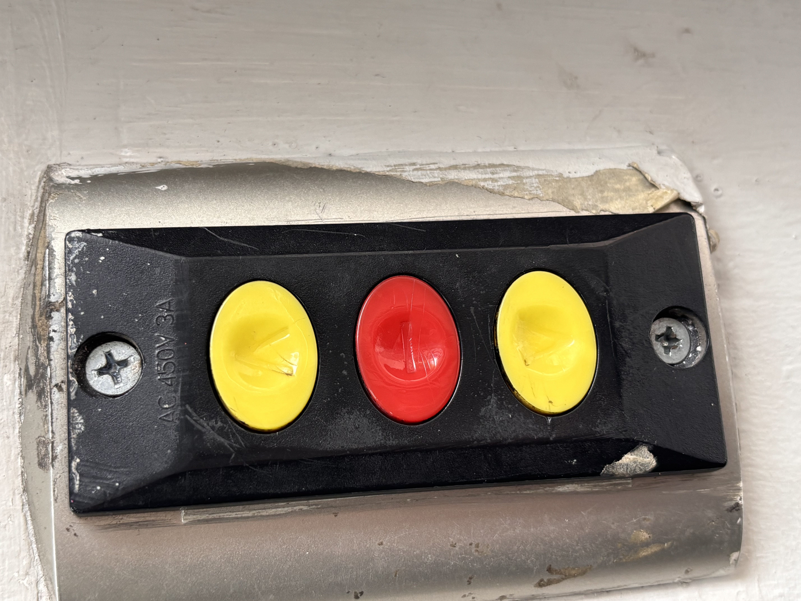
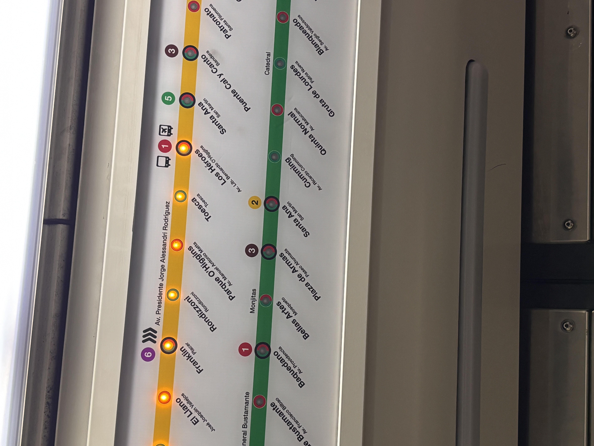
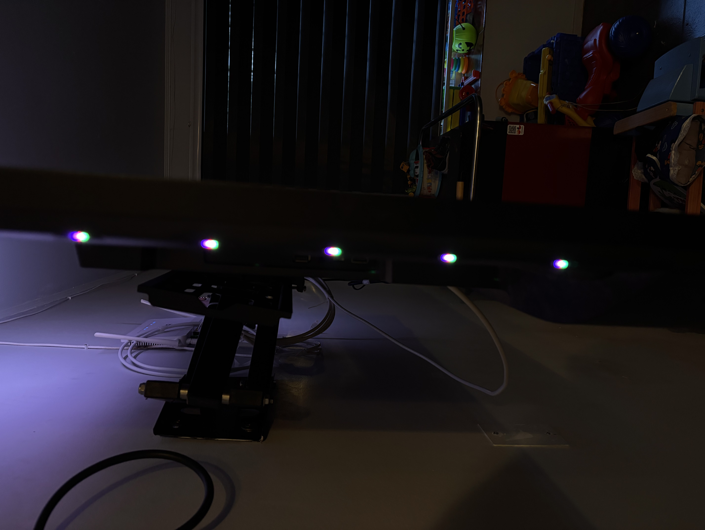
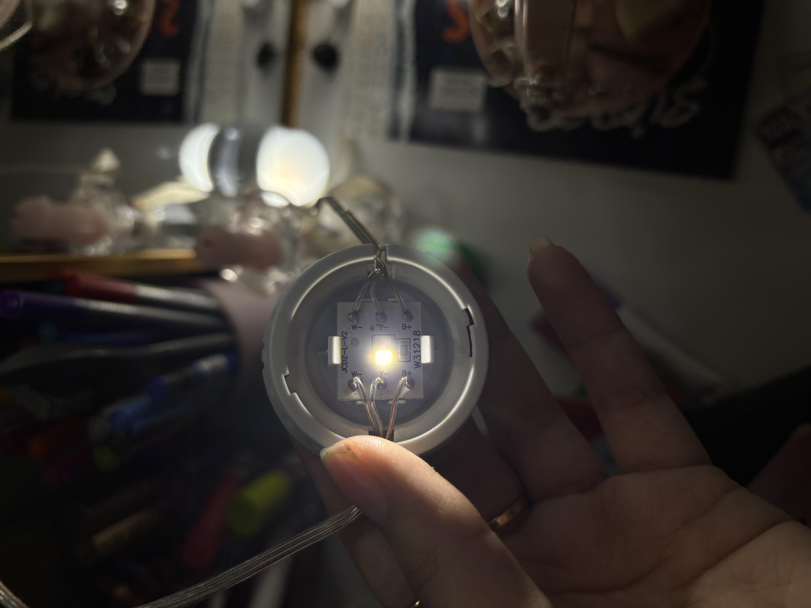

# sesion-08a

martes 2026-10-06

## apuntes sesión

las clases son:
- atributos (acciones)
- métodos (funciones)

tambien la clases nos permiten crear subclases

**ejemplo de clase**

```cpp

class Algo {

// atributos []
bool
int

// metodos ()

}
```

#### ejemplo 1 de clase Lucecita/LED

- clase Lucecita
- en general: **encendido = sí o no**
- algunos de los parámetros podría ser la intensidad de la luz: **brillo = 2.55 (encendido) o 0 (apagado)**
- parpadeo = tiempo
  - ejemplo parpadero:

```cpp
luzNavidad = Lucecita [100];
```

- color = **rojo, verde o azul**
- interacción: **Botón = Lucecita = usuario**

### ejemplo 1.2 de clase EspantaCuco

```cpp
int precio;
Lucecita espantadora;
sensor luminoso;
```

en esta clase pudimos utilizar la clase Lucecita y pasaria siendo una subclase de EspantaCuco

### ejemplo 2 de clase Helado

```cpp
class Helado

int precio;
cremosidad;
vegano
```


### ejemplo de clases creada por aaron y matias


hoy hicimos 3 clases: **Boton, Perilla y Lucecita**

main.cpp

```cpp
// hay 3 elementos
// lucecita
// perilla
// pulsador

// lucecita necesita R de 220
// perilla necesita nada
// pulsador necesita R de 10k

// entradas
// o sensores
// perilla - posicion rotacional / giro
// pulsador - si o no hay presion

// salidas
// o actuadores
// lucecita

// ya pero y?

// pulsador: prender y apagar todo
// potenciometro: frecuencia de parpadeo

// lucecita: prender y apagarse
// segun lo que diga boton y perilla

// por lo tanto
// boton tiene dos estados
// prendido y apagado

// perilla va a tener
// una posicion que va a ser
// usada por el sistema
// para impactar en parpadeo lucecita


#include <stdio.h>
#include "pico/stdlib.h"

#include "Boton.h"
#include "Perilla.h"
#include "Lucecita.h"

int main() {
  stdio_init_all();


  // instanciar Boton llamado pulsador
  // a partir de la clase Boton
  // con el parametro
  Boton pulsador(7);

  // lo mismo pero con perilla
  Perilla parpadeo(26);

  Lucecita luz(6);


  while (true) {
    
    // leer perilla parpadeo
    parpadeo.leer();

    // si perilla esta izquierda
    // led apagado
    // si perilla esta derecha
    // led prendido

    if (parpadeo.posicion < 4096 /2) {

      luz.apagar();
    } else {
      luz.prender();
    }

   
    printf("%d\n", parpadeo.posicion);
    sleep_ms(250);
  }
}


```


## encargos

encargo-08a:

1. tomar muchas fotos, mínimo 3 por cada uno de los 3 elementos que estudiamos hoy: perillas, botones, y luces. subir las fotos a su README como respuesta a este encargo, y describirlas textualmente, para con esa info complejizar nuestras clases programadas este viernes.

2. partir del ejemplo de hoy, que está subido en codigos/ de hoy, y hacer que las luces parpadeen. para eso, definir parpadeo de forma paramétrica.


### tomar fotos a 3 elementos vistos en clases: perrillas, botones y luces

1. perilla

**perilla 1**



descripción: es la perilla del microondas de mi casa, tiene una multifunción en el microondas (tiempo, peso, auto y menu)

**perilla 2**



descripción: es la perilla de mi lavadora tiene la pantallita al costado, en donde si la perrilla de la lavadora se gira en la pantallita se muestra las diferentes funciones de lavado (ropa de cama, ropa de bebé, lavado rápido, algodón, lavado y secado, entre otros)
**perilla 3**



descripción: en esta imagen hay 2 perillas giratorias del microondas que esta en el taller de mi práctica. La perilla superior regula el nivel de potencia (baja - descongelar- media-baja - media - alta) y la inferior ajusta el tiempo de funcionamiento o peso a descongelar

2. botones

**botón 1**



descripción: botón interruptor de los congeladores que estamos haciendo en mi practica, consiste en el encendido y apagado del congelador es de color verde y cuenta con luz interna, la cual se enciende cuando el equipo está en función/encendido

**botón 2**



descripción: botón de ascensor para seleccionar piso o función (en este caso el botón que esta en funcionamiento es el botón de abrir puertas), es de acero inoxidable(creo) con lectura táctil en braille, también cuenta con iluminación que se enciende de color rojo al ser presionado/activado

**botón 3**



descripción: es una botonera triple de control para cortinas o rejas metálicas enrollables, la verdad nunca los he visto en funcionamiento pero el conserje del edificio me explico que contiene los 3 botones y cada uno con símbolos diferentes, están las flechas para controlar el movimiento de abrir/subir y cerrar/bajar las cortinas metálicas (botones amarillos) y el de detener las cortinas metálicas (el botón rojo)

3. luces

**lucecita 1**



descripción: la lucecita es un LED amarillo naranjazo según mi vista (no confíen uso lentes :)) ubicada en la ruta que hace la línea 2 del metro de Santiago. Su función es más visual y ayuda al estado del viaje mediante cambios de frecuencia? en palabras simples, parpadeo luminoso (al ir a la siguiente estación comienza a parpadear, ejemplo: yo estaba en Santa Ana, la siguiente estación Los Héroes comenzó a parpadear ya que íbamos en camino a esa estación)

**lucecita 2**



descripción: los luce LED que se encuentran en  mi tele (venían ya incorporadas en esta al comprarla), según yo cuenta con el sistema de iluminación LED RGB ubicada en la parte posterior de los costados del televisor. Su función es proyectar luz sobre la pared para extender los colores de la pantalla en tiempo real y mejorar la experiencia visual, en pocas palabras para ambientar (que elegancia)


**lucecita 3**



descripción: son luces LED de mi vanity, es una especie de cadena en la cual vienen 10 lucecitas (LED), cuenta con 3 tonos de iluminación frío, cálido y neutra, también conectado en serie a través de un cableado transparente, y cuenta con un LED por foco


### intento de luces parpadeantes

la verdad no tuve tiempo de hacer esta parte del encargo, estuve con muchas cosas en la práctica y se me olvido hacerlo :(

## lectura
nos dejaron elegir un libro para leer durante el semestre en el cual debemos dejar 2 citas por clase y leer mínimo 100 paginas durante el semestre

libro escogido **La Música electroacústica en Chile** de Federico Schumacher

### capítulo leído del libro 
- **La visita de Werner Meyer-Eppler**
   - en 1958, el experto alemán Werner Meyer-Eppler visitó Chile e impartió charlas sobre música electrónica
   - su visita entusiasmó a compositores locales como Asuar, quien aprendió de sus técnicas y escuchó música electrónica por primera vez
   - esta llegada legitimó la electroacústica en el país y sentó las bases teóricas y prácticas para el género
   - impulsados por el encuentro, Asuar y Juan Amenábar propusieron a la Universidad de Chile crear el primer laboratorio de electroacústica


### citas del libro

**cita 1**: 

**_"...ahí en una mesa nos comunicábamos a circuito y fórmula pura."_**

página 43

**opinión:** a pesar de no hablar el mismo idioma, usaron como lenguaje "universal" los circuitos para poder comunicarse y entenderse

**cita 2**: 

**_"Estudios de notación electrónico-musical."_**

página 44

**opinión:**  la verdad escogí esta cita porque suena profesional y al leerla sin contexto, es como algo lejano (yo entiendo como "notación musical" como música clásica o notas clásicas pero al agregarle "electrónico" es como "música clásica robótica")

