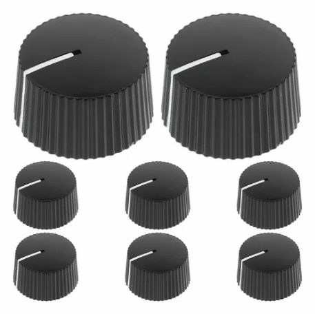
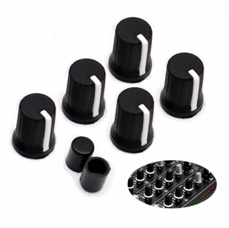
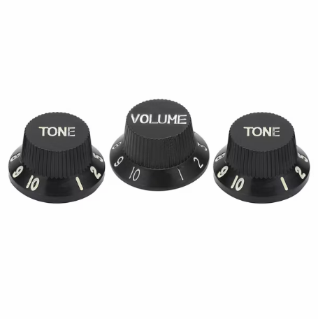
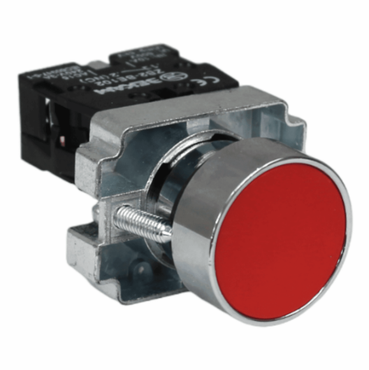
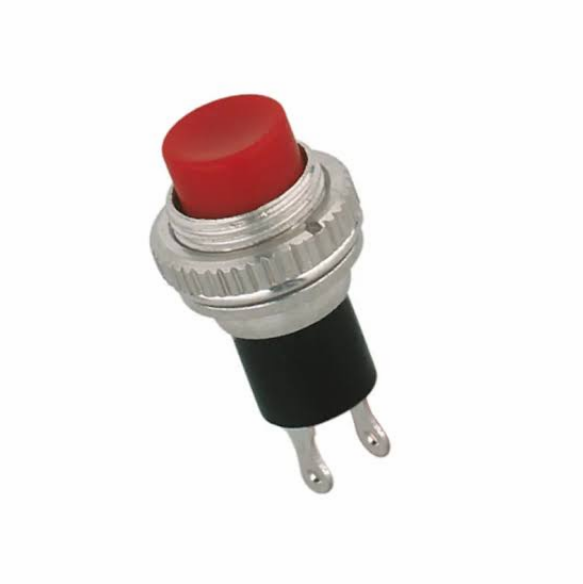
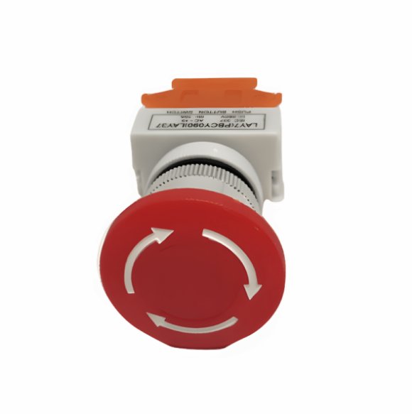
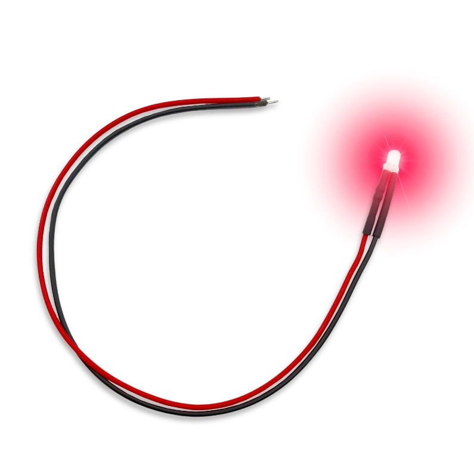
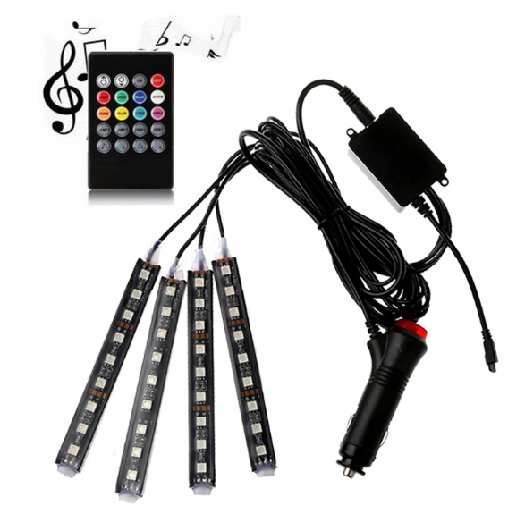
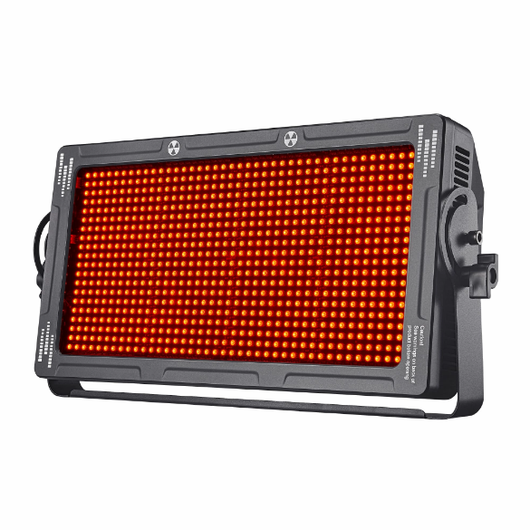

# sesion-08a

06-10-2026

## apuntes sesión

Lógica de las clases - Muchas cosas

para modelar o crear

Personas y 1 que se llama Kris

Matías también se llama Misaa - nombre artístico

Atributos y métodos son los que están adentro de las clases, forma o función

en este curso nos vamos a alejar del modelar un poco y nos concentraremos en crear

hay que ahorrar espacio, optimizar programación y hay un factor de mantención Constructor

### vamos a hacer una clase de LED

Clase Lucecita

tiene un estado que se llama encendido y un conjunto de valores (resumido) que pueden ser SÍ o NO

hay un conjunto de valores que puede decir cuán encendido está y puede llamarse brillo ej: de 0 a 255 y luego elegimos en qué valor de ahí para arriba o para abajo está encendido y cuál no, que se llama UMBRAL

Parpadeo: -tiempo LuzNavidad = Lucecita [100];

Los arreglos están en orden

hay color = rojo, verde, azul

va a haber un Usuario y una Lucecita y otro Botón y van a ser clases

Puede haber otra clase que se llame EspantaCuco

int precio;

"instancia de clase - es haber usado el molde que llamamos Lucecita y crear una de ellas" Lucecita espantadora;

Sensor lumínico;

puede pasar que Lucecita sea algo tan abstracto en el sentido de lejano y no de difuso (reducir la complejidad a algo de una sola expresión)

Clase helado
int precio
cremosidad
vegano

class HeladoChirimoya {

heredó Helado; cremosidad de la Chirimoya = 100%;

## encargos

encargo-08a:

1. tomar muchas fotos, mínimo 3 por cada uno de los 3 elementos que estudiamos hoy: perillas, botones, y luces. subir las fotos a su README como respuesta a este encargo, y describirlas textualmente, para con esa info complejizar nuestras clases programadas este viernes.

2. partir del ejemplo de hoy, que está subido en codigos/ de hoy, y hacer que las luces parpadeen. para eso, definir parpadeo de forma paramétrica.

### Solución ercargo

| Imagen | Descripción |
|:---:|:---|
|  | Es un círculo extruido hacia otro círculo de menor radio, con una diferencia aproximada de 0,4 mm entre ambos. La extrusión tiene una longitud de aproximadamente 2 cm. En la superficie lateral presenta surcos cada 1 mm y, desde el centro de la cara superior, una línea blanca que se extiende hasta el borde exterior de la perilla. |
|  | Círculos del mismo tamaño, extruidos aproximadamente 2 cm, con una línea blanca que recorre el centro hasta el borde exterior. Presenta surcos distribuidos cada 4 mm aproximadamente por toda la superficie lateral. |
|  | Círculo extruido 3 mm hasta formar otro del mismo tamaño. En ese punto presenta un relieve diagonal uniforme que se dirige hacia el interior, formando un nuevo círculo de menor tamaño, ubicado aproximadamente a la mitad del radio del primero. Desde este tercer círculo se desarrolla una segunda extrusión diagonal, menos pronunciada, que alcanza una longitud aproximada de 1,5 cm y termina en un círculo aún más pequeño. Esta segunda extrusión presenta surcos verticales cada 1 mm aproximadamente, mientras que las demás superficies son lisas. |

| Imagen | Descripción |
|:---:|:---|
|  | Círculo pulsable hacia adentro de color rojo, creado sobre una superficie cilíndrica que lo rodea. Debajo tiene una superficie cuadrada extruida que hace de base, con un tornillo en la base y no en el círculo ni en el cilindro, para unir las piezas. |
|  | Círculo rojo extruido que sobresale de un soporte semicircular con surcos en el borde cada 1 mm aprox. Soporte metálico con una parte inferior que está envuelta por plástico y de la cual sobresalen 2 patitas metálicas, una a cada lado. |
|  | Círculo de poca extrusión de color rojo que en el centro tiene un palito que lo une a una caja inferior que funciona como mecanismo, pero está oculto por la caja. Los círculos exteriores extruidos mencionados anteriormente se pueden empujar hasta que choquen con la caja que tienen debajo. Tiene 3 flechas curvas en la cara exterior del primer círculo, que son de color blanco, de unos 3 mm de grosor aprox. y van en el sentido de las agujas del reloj, con un leve espacio entre ellas, siguiendo una a la otra y formando un casi círculo que va en una dirección. En la parte inferior del palo, pero antes de llegar a la caja, tiene en su borde surcos cada 1 mm aprox. |

| Imagen | Descripción |
|:---:|:---|
|  | Brillo envuelto por una cupula curba en su inicio y recta hasta llegar a la superficie recta de soporte de 1cm aprox de largo con 2 paritas de metal que sobre salen del centro pero separadas una de cada cual y una mas larga que otra|
|  | tira de plastico negro con cuadrados dispuestos sobre una cara de la tira y los cuadrados alejados unos de cada uno por 1cm aprox, entre ellos hay chips pequeños o circulos o cuadrados mas pequeños pero de metal |
|  |  |

## lectura
