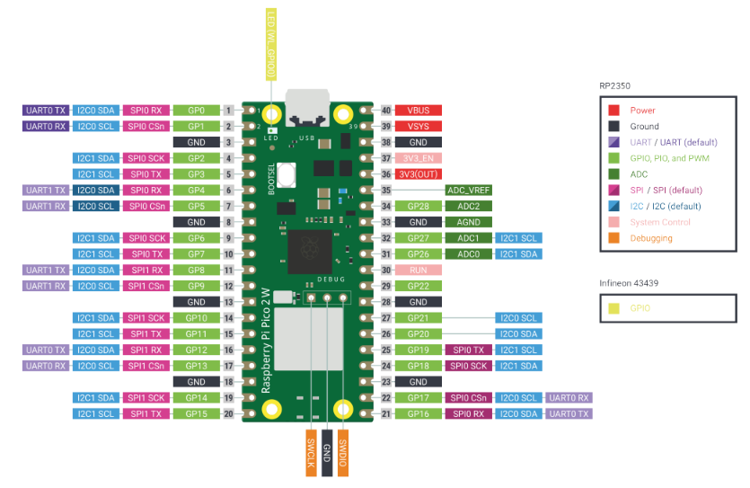
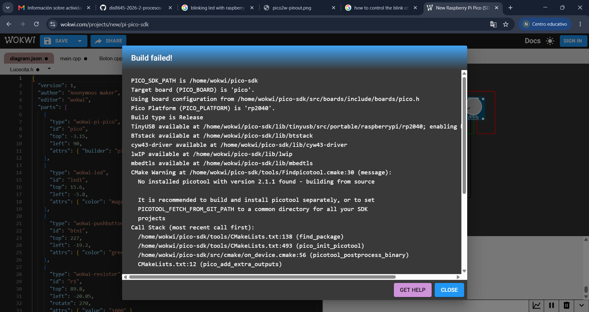

# sesion-08a

## apuntes sesión

> ``.h`` tiene poemas, ``.cpp`` tiene responsabilidad afectiva

### entradas y salidas

las entradas son los sensores, los que mandan señales, como por ejemplo:

+ pulsadores (push button)
+ potenciómetros
+ LDR

las salidas son los actuadores, los que reciben la señal y responden en base a ésta, como por ejemplo:

+ LED
+ motores

---

cuando creamos un botón se le llama _instanciar_!!

``Perilla`` -> sin contexto

``Perilla::Perilla`` -> el significado de _Perilla_ dentro de la clase _Perilla_

#### ADC

ADC o _Analog Digital Convertor_ es lo que convierte la señal analógica en un valor digital que nuestra raspi pueda procesar. este tiene más resolución en comparación al del Arduino!! con Arduino teníamos resolución de 0-1023, mientras que con la raspi tenemos de 0-4095:)

en la Raspberry Pi Pico 2W hay cuatro pines ADC:



---

## encargos

encargo-08a:

1. tomar muchas fotos, mínimo 3 por cada uno de los 3 elementos que estudiamos hoy: perillas, botones, y luces. subir las fotos a su README como respuesta a este encargo, y describirlas textualmente, para con esa info complejizar nuestras clases programadas este viernes.

2. partir del ejemplo de hoy, que está subido en codigos/ de hoy, y hacer que las luces parpadeen. para eso, definir parpadeo de forma paramétrica.

hola, esta vez no logré hacer los encargos a tiempo, pero de igual manera quise revisar cómo poder lograr pestañear con el LED asi que me metí a revisar forks de mis compañeres para ver cómo lo lograron. al revisarlos, el ejercicio que mejor entendí fue el de [angel-udp](<https://github.com/angel-udp/dis8645-2026-2-procesos-2/tree/main/27-angel-udp/sesion-08a/codigos/2026-10-06-clases%20Tarea%20Parpadeo>), asi que traté de añadir los cambios yo mismo al Wokwi original, y al momento de correr el código me aparecía el siguiente error:



```
PICO_SDK_PATH is /home/wokwi/pico-sdk
Target board (PICO_BOARD) is 'pico'.
Using board configuration from /home/wokwi/pico-sdk/src/boards/include/boards/pico.h
Pico Platform (PICO_PLATFORM) is 'rp2040'.
Build type is Release
TinyUSB available at /home/wokwi/pico-sdk/lib/tinyusb/src/portable/raspberrypi/rp2040; enabling build support for USB.
BTstack available at /home/wokwi/pico-sdk/lib/btstack
cyw43-driver available at /home/wokwi/pico-sdk/lib/cyw43-driver
lwIP available at /home/wokwi/pico-sdk/lib/lwip
mbedtls available at /home/wokwi/pico-sdk/lib/mbedtls
CMake Warning at /home/wokwi/pico-sdk/tools/Findpicotool.cmake:30 (message):
  No installed picotool with version 2.1.1 found - building from source

  It is recommended to build and install picotool separately, or to set
  PICOTOOL_FETCH_FROM_GIT_PATH to a common directory for all your SDK
  projects
Call Stack (most recent call first):
  /home/wokwi/pico-sdk/tools/CMakeLists.txt:138 (find_package)
  /home/wokwi/pico-sdk/tools/CMakeLists.txt:493 (pico_init_picotool)
  /home/wokwi/pico-sdk/src/cmake/on_device.cmake:56 (picotool_postprocess_binary)
  CMakeLists.txt:12 (pico_add_extra_outputs)


Downloading Picotool
/home/wokwi/project/src/Lucecita.cpp: In member function 'void Lucecita::parpadear(int)':
/home/wokwi/project/src/Lucecita.cpp:51:3: error: 'sleep_ms' was not declared in this scope
   51 |   sleep_ms(tiempo);
      |   ^~~~~~~~
make[2]: *** [CMakeFiles/wokwi_project.dir/build.make:93: CMakeFiles/wokwi_project.dir/src/Lucecita.cpp.o] Error 1
make[2]: *** Waiting for unfinished jobs....
make[1]: *** [CMakeFiles/Makefile2:2259: CMakeFiles/wokwi_project.dir/all] Error 2
make: *** [Makefile:91: all] Error 2

Error: Process exited with 2
```

al estar con sueño, no leí en realidad lo que me decía que estaba mal, y me confundía ver que me mencionaba el void de parpadear, hasta que revisé side to side el código de _Lucecita.cpp_ que anoté yo y el de mi compañero, en donde noté un cambio importante: la solución agregar ``#include "pico/stdlib.h"`` en _Lucecita.cpp_ lol.

dejaré el trabajo en la carpeta, pero quiero volver a esto en algún momento para lograr hacer funcionar el botón para que prenda y apague todo. pido disculpas por no poder tener el encargo a tiempo, pero quiero que sepan que no es por falta de interés, sino por atados externos.

---

## lectura
