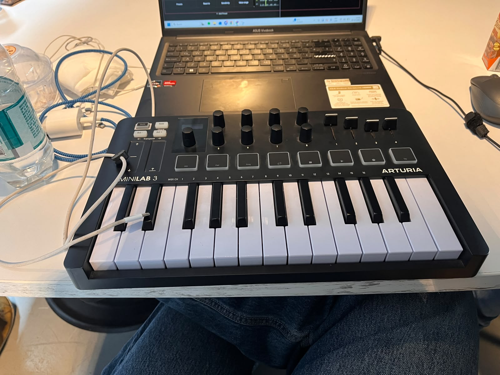
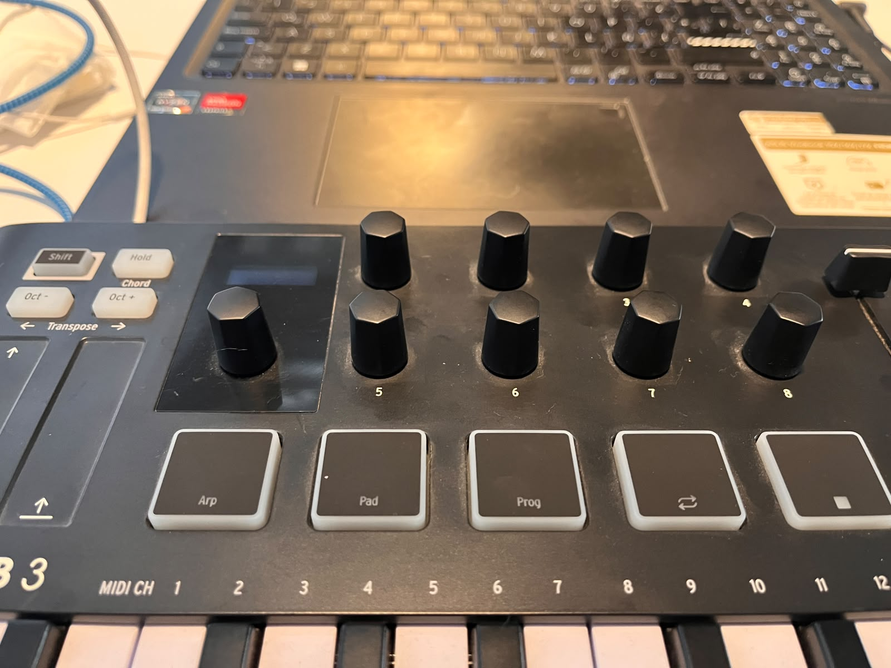
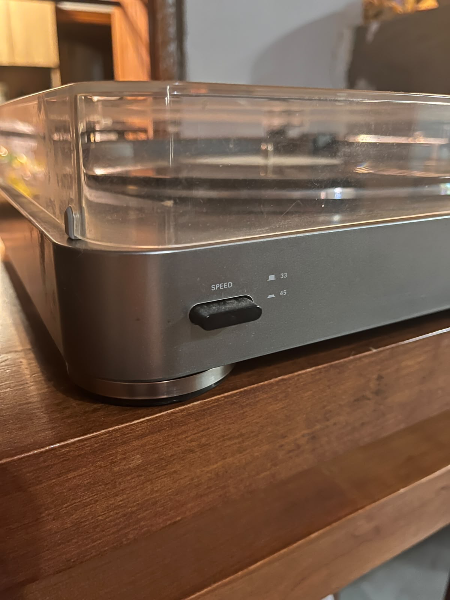
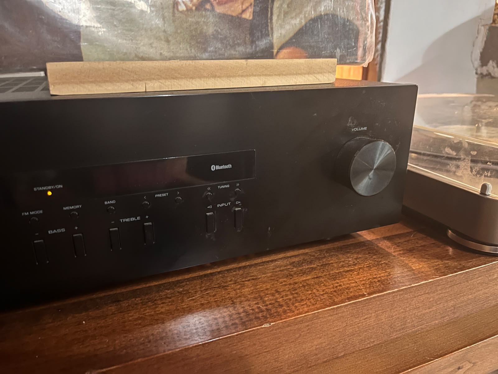
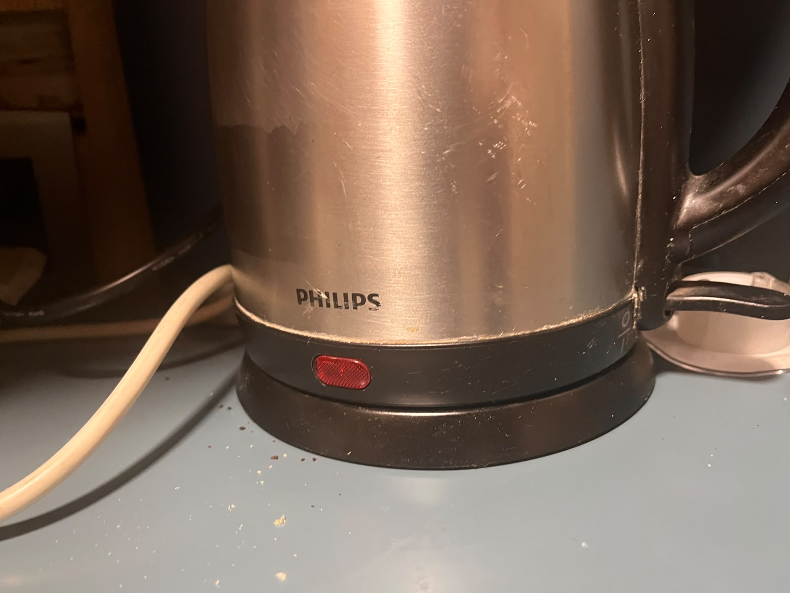
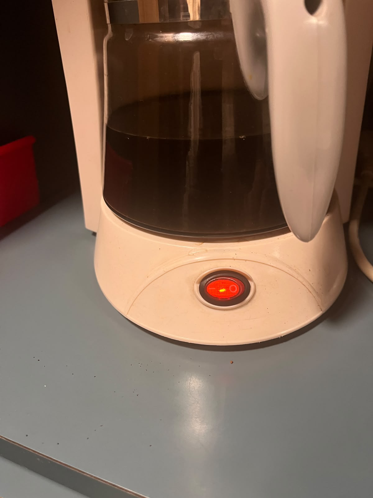

# sesion-08a

## apuntes sesión
2026-10-06 
ejemplo lucecita : 
- tiene un estado de encendido: si o no 
- el brillo va entre 0 a 255
- umbral es como la distancia entre encendido o no 
- parpadeo y tiempo 
- Alberto Fuguet 
- las clases nos permiten hacer subclases  
- al ingresar una perilla en la class siempre hay que poner los atributos,constructor y el metodo. 

 ```cpp
//atributos
int posicion= 0; 
int patita;

//constructor 
Perilla (int Nuevapatita) 

//metodos
void leer(); 
 ```

-Perilla:: significa un llamado de que esta adentro de esa clase 
- ADC tiene mayor resolucion son 12 bits 

## encargos

encargo-08a:

## 1. tomar muchas fotos, mínimo 3 por cada uno de los 3 elementos que estudiamos hoy: perillas, botones, y luces. subir las fotos a su README como respuesta a este encargo, y describirlas textualmente, para con esa info complejizar nuestras clases programadas este viernes.
# MIDI



Para mi ramo de Dispositivos Perifericos del día jueves con el profe Felipe Roa nos enseño un teclado controlador MIDI, muuuy cool. Nos comenzó contando como se usa y se conecta al computador, lo que pude rescatar de este objeto respecto a la tarea es que tiene potenciometros sin tope osea no tienen punto de inicio ni punto final mecánico, pueden girar 360° indefinidamente en ambas direcciones y uno atravez del compu uno puede definirle la acción que quiero que haga cada potenciometro atravez del midi. 

Ya despues con los botones son para controlar las funciones rápidas del teclado y segun lo que dice internet son pads sensitivos, eso significa resistencias variables por presión.


# TOCADISCOS 

Ahora elegi de botón del tocadiscos de mi casa, este tiene 4 botones claves para que funcione, pero ocupe de ejemplo el de "speed" selector de velocidad del plato, aunque tambien esta al otro lado del tocadiscos el de start, stop y el de bajar la aguja según yo.

Bueno su funcionamiento es que cambia la velocidad de rotación del motor entre las dos velocidades de reproducción de vinilos 33 RPM Y 45 RPM, entonces cuando presionas el boton este se hunde y genera la velocidad de 45 RPM, este queda hundido hasta que lo vuelvas a presionar y asi vuelve a neutro.

# RADIO 

Aquí tengo fotos de la radio de mi casa, esta el sistema de la perilla del volumen donde al girarlo en sentido horario o antihorario, envía señales digitales para  ajustar el nivel de salida de audio, donde este potenciometro presenta tope de giro.

# HERVIDOR

Este hervidor tiene su luz roja que solamente se enciende cuando se genera la acción de bajar la perilla y calentar el agua,obvio se apaga cuando el agua llego a su temperatura maxima.

# CAFETERA

Este es el botón y luz LED de una cafetera. El indicador señala que se está calentando o preparando el café. Una vez encendido, la placa alcanza una temperatura máxima constante para mantener la bebida caliente. A diferencia de un hervidor, esta botón no se apaga sola porque la cafetera no cuenta con apagado automático.

## 3. partir del ejemplo de hoy, que está subido en codigos/ de hoy, y hacer que las luces parpadeen. para eso, definir parpadeo de forma paramétrica.

encargo semana pasada; 
1- usar el ejemplo base visto en clases https://wokwi.com/projects/476507507193136129, agregar un segundo botón en la simulación de hardware, agregar una segunda instancia de la clase Boton, agregarle un atributo y un método a la clase Boton, y hacer que el segundo botón haga algo diferente al primero.
2- descargar todos los archivos de wokwi, descomprimir el archivo.zip y subir esa carpeta a tu repositorio en esta sesión.
## lectura
