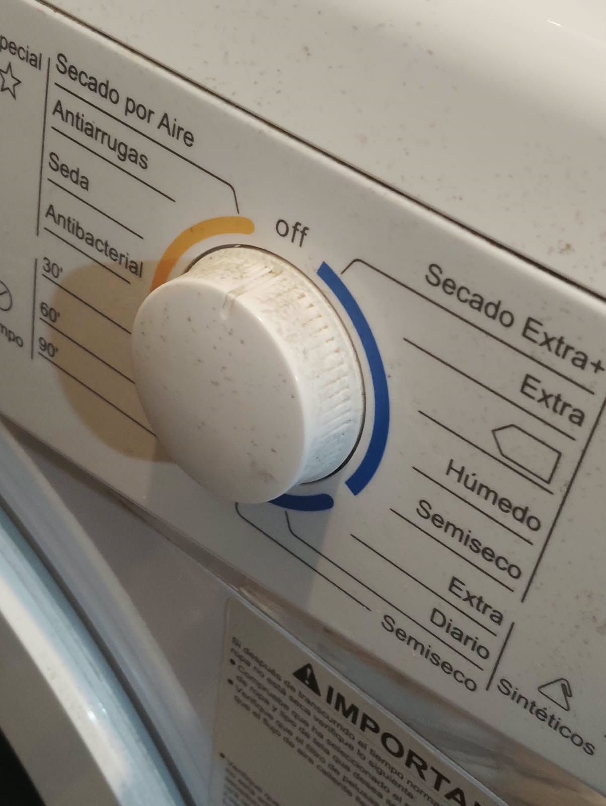
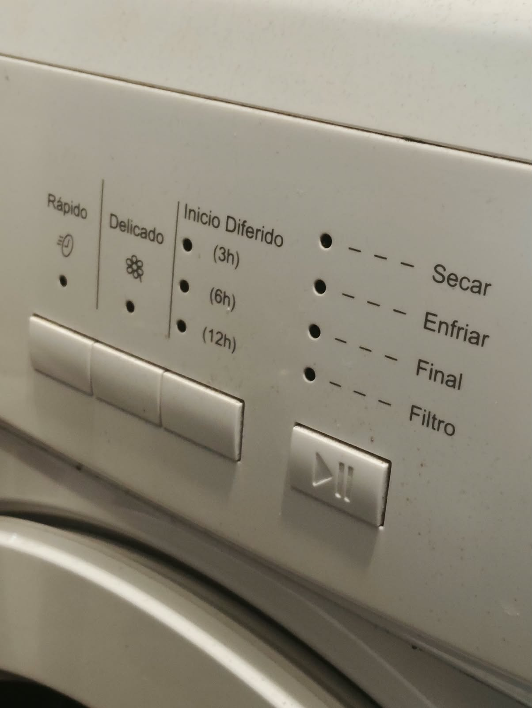
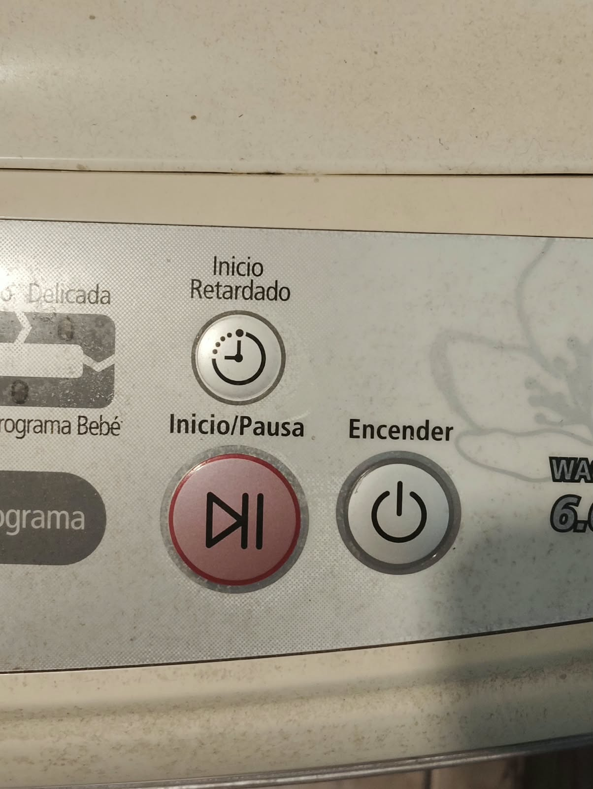

# sesion-08a

## apuntes sesión

PARA QUÉ SON LAS CLASES

clasifican, modelan y crean 

Clase Lucecita

las luz puede estar encendida o apagada. pueden tener brillo parpadeo, color. 

Las clases pueden tener atributos y otras clases que definen la nueva clase. por ejemplo, usar la clase luz para otra clase llamada espantaCuco que contiene una luz y necesita la definición de ella.

La clase presenta atributos, ejemplo helado con cremosidad, precio, vegano o no. y si hago otra clase de un helado específico, cómo chirimoya, le asigno valores a esos atributos. SUBCLASES.

las clases interactúan unas con otras. 

-cajas negras

para la class Perilla

los atributos contienen, int posicion, int patita.

en el constructor: Perilla (int nuevaPatita);

Métodos: aquí van las acciones, si se repiten una acción como leer(); da lo mismo si hay dos, uno en la class Boton y otro en Perilla. no hace problema. 

PREFIJO “nombre de la clase ::” antes de todas las funciones que se explicarán en el archivo cpp. significa que está dentro de la clase. además, va junto con {} donde se señala como actúa o que hace. 

las perillas son más complejas por la informacion gris con valores intermedios, no es solo si o no, o 0 y 1. 

ADC

para la perilla requiere incluir en perilla.h un #include “hardware/adc.h”

y en perilla.cpp hay que inicializar el adc con adc_init(); 

luego tambien colocar un adc_gpio_init(perilla::patita); 

parpadeo controlamos durante cuanto tiempo se apaga o prende en el parpadeo y cada cuanto lo hace. tiempo y frecuencia.

## encargos

encargo-08a:

1. tomar muchas fotos, mínimo 3 por cada uno de los 3 elementos que estudiamos hoy: perillas, botones, y luces. subir las fotos a su README como respuesta a este encargo, y describirlas textualmente, para con esa info complejizar nuestras clases programadas este viernes.

FOTOS ENCARGO

2. partir del ejemplo de hoy, que está subido en codigos/ de hoy, y hacer que las luces parpadeen. para eso, definir parpadeo de forma paramétrica.

## lectura
